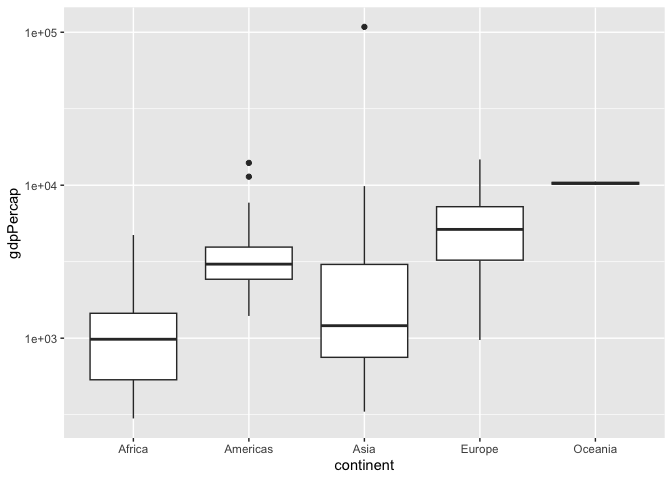

Gapminder
================
Lily Jiang
2023-03-20

- [Grading Rubric](#grading-rubric)
  - [Individual](#individual)
  - [Due Date](#due-date)
- [Guided EDA](#guided-eda)
  - [**q0** Perform your “first checks” on the dataset. What variables
    are in this
    dataset?](#q0-perform-your-first-checks-on-the-dataset-what-variables-are-in-this-dataset)
  - [**q1** Determine the most and least recent years in the `gapminder`
    dataset.](#q1-determine-the-most-and-least-recent-years-in-the-gapminder-dataset)
  - [**q2** Filter on years matching `year_min`, and make a plot of the
    GDP per capita against continent. Choose an appropriate `geom_` to
    visualize the data. What observations can you
    make?](#q2-filter-on-years-matching-year_min-and-make-a-plot-of-the-gdp-per-capita-against-continent-choose-an-appropriate-geom_-to-visualize-the-data-what-observations-can-you-make)
  - [**q3** You should have found *at least* three outliers in q2 (but
    possibly many more!). Identify those outliers (figure out which
    countries they
    are).](#q3-you-should-have-found-at-least-three-outliers-in-q2-but-possibly-many-more-identify-those-outliers-figure-out-which-countries-they-are)
  - [**q4** Create a plot similar to yours from q2 studying both
    `year_min` and `year_max`. Find a way to highlight the outliers from
    q3 on your plot *in a way that lets you identify which country is
    which*. Compare the patterns between `year_min` and
    `year_max`.](#q4-create-a-plot-similar-to-yours-from-q2-studying-both-year_min-and-year_max-find-a-way-to-highlight-the-outliers-from-q3-on-your-plot-in-a-way-that-lets-you-identify-which-country-is-which-compare-the-patterns-between-year_min-and-year_max)
- [Your Own EDA](#your-own-eda)
  - [**q5** Create *at least* three new figures below. With each figure,
    try to pose new questions about the
    data.](#q5-create-at-least-three-new-figures-below-with-each-figure-try-to-pose-new-questions-about-the-data)

*Purpose*: Learning to do EDA well takes practice! In this challenge
you’ll further practice EDA by first completing a guided exploration,
then by conducting your own investigation. This challenge will also give
you a chance to use the wide variety of visual tools we’ve been
learning.

<!-- include-rubric -->

# Grading Rubric

<!-- -------------------------------------------------- -->

Unlike exercises, **challenges will be graded**. The following rubrics
define how you will be graded, both on an individual and team basis.

## Individual

<!-- ------------------------- -->

| Category    | Needs Improvement                                                                                                | Satisfactory                                                                                                               |
|-------------|------------------------------------------------------------------------------------------------------------------|----------------------------------------------------------------------------------------------------------------------------|
| Effort      | Some task **q**’s left unattempted                                                                               | All task **q**’s attempted                                                                                                 |
| Observed    | Did not document observations, or observations incorrect                                                         | Documented correct observations based on analysis                                                                          |
| Supported   | Some observations not clearly supported by analysis                                                              | All observations clearly supported by analysis (table, graph, etc.)                                                        |
| Assessed    | Observations include claims not supported by the data, or reflect a level of certainty not warranted by the data | Observations are appropriately qualified by the quality & relevance of the data and (in)conclusiveness of the support      |
| Specified   | Uses the phrase “more data are necessary” without clarification                                                  | Any statement that “more data are necessary” specifies which *specific* data are needed to answer what *specific* question |
| Code Styled | Violations of the [style guide](https://style.tidyverse.org/) hinder readability                                 | Code sufficiently close to the [style guide](https://style.tidyverse.org/)                                                 |

## Due Date

<!-- ------------------------- -->

All the deliverables stated in the rubrics above are due **at midnight**
before the day of the class discussion of the challenge. See the
[Syllabus](https://docs.google.com/document/d/1qeP6DUS8Djq_A0HMllMqsSqX3a9dbcx1/edit?usp=sharing&ouid=110386251748498665069&rtpof=true&sd=true)
for more information.

``` r
library(tidyverse)
```

    ## ── Attaching packages ─────────────────────────────────────── tidyverse 1.3.2 ──
    ## ✔ ggplot2 3.4.0      ✔ purrr   1.0.1 
    ## ✔ tibble  3.1.8      ✔ dplyr   1.0.10
    ## ✔ tidyr   1.2.1      ✔ stringr 1.5.0 
    ## ✔ readr   2.1.3      ✔ forcats 0.5.2 
    ## ── Conflicts ────────────────────────────────────────── tidyverse_conflicts() ──
    ## ✖ dplyr::filter() masks stats::filter()
    ## ✖ dplyr::lag()    masks stats::lag()

``` r
library(gapminder)
```

*Background*: [Gapminder](https://www.gapminder.org/about-gapminder/) is
an independent organization that seeks to educate people about the state
of the world. They seek to counteract the worldview constructed by a
hype-driven media cycle, and promote a “fact-based worldview” by
focusing on data. The dataset we’ll study in this challenge is from
Gapminder.

# Guided EDA

<!-- -------------------------------------------------- -->

First, we’ll go through a round of *guided EDA*. Try to pay attention to
the high-level process we’re going through—after this guided round
you’ll be responsible for doing another cycle of EDA on your own!

### **q0** Perform your “first checks” on the dataset. What variables are in this dataset?

``` r
## TASK: Do your "first checks" here!
glimpse(gapminder)
```

    ## Rows: 1,704
    ## Columns: 6
    ## $ country   <fct> "Afghanistan", "Afghanistan", "Afghanistan", "Afghanistan", …
    ## $ continent <fct> Asia, Asia, Asia, Asia, Asia, Asia, Asia, Asia, Asia, Asia, …
    ## $ year      <int> 1952, 1957, 1962, 1967, 1972, 1977, 1982, 1987, 1992, 1997, …
    ## $ lifeExp   <dbl> 28.801, 30.332, 31.997, 34.020, 36.088, 38.438, 39.854, 40.8…
    ## $ pop       <int> 8425333, 9240934, 10267083, 11537966, 13079460, 14880372, 12…
    ## $ gdpPercap <dbl> 779.4453, 820.8530, 853.1007, 836.1971, 739.9811, 786.1134, …

**Observations**:

- country, continent, year, lifeExp (life expectancy), pop (population),
  gdpPercap (GDP per capita)

### **q1** Determine the most and least recent years in the `gapminder` dataset.

*Hint*: Use the `pull()` function to get a vector out of a tibble.
(Rather than the `$` notation of base R.)

``` r
year_max <- gapminder %>%
  summarize(year = max(year)) %>%
  pull(year)
year_min <- gapminder %>%
  summarize(year = min(year)) %>%
  pull(year)

year_min
```

    ## [1] 1952

Use the following test to check your work.

``` r
## NOTE: No need to change this
assertthat::assert_that(year_max %% 7 == 5)
```

    ## [1] TRUE

``` r
assertthat::assert_that(year_max %% 3 == 0)
```

    ## [1] TRUE

``` r
assertthat::assert_that(year_min %% 7 == 6)
```

    ## [1] TRUE

``` r
assertthat::assert_that(year_min %% 3 == 2)
```

    ## [1] TRUE

``` r
if (is_tibble(year_max)) {
  print("year_max is a tibble; try using `pull()` to get a vector")
  assertthat::assert_that(False)
}

print("Nice!")
```

    ## [1] "Nice!"

### **q2** Filter on years matching `year_min`, and make a plot of the GDP per capita against continent. Choose an appropriate `geom_` to visualize the data. What observations can you make?

You may encounter difficulties in visualizing these data; if so document
your challenges and attempt to produce the most informative visual you
can.

``` r
gapminder %>%
  filter(year == year_min) %>%
  ggplot() +
  geom_boxplot(
    aes(x = continent, y = gdpPercap)
  ) +
  scale_y_log10()
```

<!-- -->

**Observations**:

- Most of Africa’s countries have a low GDP per capita, which results in
  a skewed-right spread. The maximum GDP per capita for Africa is
  actually the lowest out of the max GDP per capita for all the
  continents.
- The Americas have a skewed-right spread, with most of the points
  falling on the lower end of the GDP per capita spectrum. However, the
  values are slightly more spread out than in Africa, as indicated by
  the skinnier violin plot. Additionally, the maximum GDP per capita in
  the Americas is noticably greater than the maximum GDP per capita in
  Africa.
- Asia has one (or possibly more) REALLY big outlier. So much so that
  the scale of the graph has to be zoomed out and almost dwarfs the rest
  of the plot. Otherwise, the rest of the GDP/capita is condensed at the
  lower end, creating yet another skewed right spread.
- Europe has the most normal-looking distribution out of all of the
  continents; the spread is only slightly skewed right compared to the
  other continents. The violin plot doesn’t bulge out super widely
  anywhere like it does with the other violin plots, and the three
  quartiles I plotted are somewhat evenly spaced (and more spread out
  than the other plots).
- Oceania looks like a horizontal line. This makes me believe that there
  are only a few points being plotted here, and they all take on similar
  values. It is very hard to draw other conclusions from this plot
  because most of the interesting information is not visible.

**Difficulties & Approaches**:

- At first (without carefully thinking about what I was plotting), I
  attempted to make a bar chart using `geom_col`. However, I noticed
  that there were weird white lines in the middle of the plot, and
  realized this didn’t actually display the actual data because I wasn’t
  counting a sum of something for each continent; rather, each continent
  had multiple points that needed to be plotted on their own.
- I tried using a regular boxplot and a violin plot. However, Asia had a
  HUGE outlier that was magnitudes higher than any other point being
  plotted, causing the scale to zoom out quite a lot. Thus, most of the
  interesting data was squashed into incomprehensible rectangles at the
  bottom of the graph. The violin plot was easier to see because some
  information could be seen with the width of the plot, but still was
  overall very hard to see.
- Lastly, I tried using a logarithmic scale on the y axis. This was the
  best solution, as it allowed me to (for the most part) clearly see the
  quartiles. Except for Australia, which has consistently stayed as a
  flat line, indicating that there is extremely little variation amongst
  those points.

### **q3** You should have found *at least* three outliers in q2 (but possibly many more!). Identify those outliers (figure out which countries they are).

``` r
gapminder %>%
  filter(year == year_min) %>%
  ggplot() +
  geom_boxplot(
    aes(x = continent, y = gdpPercap)
  )
```

<!-- -->

``` r
gapminder %>%
  filter(year == year_min) %>%
  filter(continent == "Asia") %>%
  mutate(rank = dense_rank(desc(gdpPercap))) %>%
  filter(gdpPercap > rank) %>%
  arrange(rank)
```

    ## # A tibble: 33 × 7
    ##    country          continent  year lifeExp      pop gdpPercap  rank
    ##    <fct>            <fct>     <int>   <dbl>    <int>     <dbl> <int>
    ##  1 Kuwait           Asia       1952    55.6   160000   108382.     1
    ##  2 Bahrain          Asia       1952    50.9   120447     9867.     2
    ##  3 Saudi Arabia     Asia       1952    39.9  4005677     6460.     3
    ##  4 Lebanon          Asia       1952    55.9  1439529     4835.     4
    ##  5 Iraq             Asia       1952    45.3  5441766     4130.     5
    ##  6 Israel           Asia       1952    65.4  1620914     4087.     6
    ##  7 Japan            Asia       1952    63.0 86459025     3217.     7
    ##  8 Hong Kong, China Asia       1952    61.0  2125900     3054.     8
    ##  9 Iran             Asia       1952    44.9 17272000     3035.     9
    ## 10 Singapore        Asia       1952    60.4  1127000     2315.    10
    ## # … with 23 more rows

``` r
gapminder %>%
  filter(year == year_min) %>%
  filter(continent == "Americas") %>%
  mutate(rank = dense_rank(desc(gdpPercap))) %>%
  filter(gdpPercap > rank) %>%
  arrange(rank)
```

    ## # A tibble: 25 × 7
    ##    country       continent  year lifeExp       pop gdpPercap  rank
    ##    <fct>         <fct>     <int>   <dbl>     <int>     <dbl> <int>
    ##  1 United States Americas   1952    68.4 157553000    13990.     1
    ##  2 Canada        Americas   1952    68.8  14785584    11367.     2
    ##  3 Venezuela     Americas   1952    55.1   5439568     7690.     3
    ##  4 Argentina     Americas   1952    62.5  17876956     5911.     4
    ##  5 Uruguay       Americas   1952    66.1   2252965     5717.     5
    ##  6 Cuba          Americas   1952    59.4   6007797     5587.     6
    ##  7 Chile         Americas   1952    54.7   6377619     3940.     7
    ##  8 Peru          Americas   1952    43.9   8025700     3759.     8
    ##  9 Ecuador       Americas   1952    48.4   3548753     3522.     9
    ## 10 Mexico        Americas   1952    50.8  30144317     3478.    10
    ## # … with 15 more rows

**Observations**:

- Identify the outlier countries from q2
  - First, I created a boxplot as that inherently shows the outliers. I
    noticed the same ones I could point out by eye were pretty obvious
    outliers in the boxplots, verifying what I had seen by eye. Then, to
    figure out what those countries were, I rearranged the dataset to
    have the highest GDP per capita for Africa and the Americas at the
    top of the dataset.

  - The biggest outlier was from Asia, as seen by the really long top of
    the Asia violin plot. After filtering the dataset by year and
    continent, then filtering again to get only outliers, and then
    sorting it by ranking the GDP per capita, I found that the most
    outlying country was Kuwait with a whopping 108382.3529. This is
    magnitudes higher than any other country!

  - I noticed that the Americas also has some outliers, because of how
    long the top tail end of the plot was compared to the bulging part
    of it. Additionally, on this tail, I can see two tiny spots that
    would indicate a country’s GDP per capita. To find those 2 outliers
    within the Americas, I simply repeated the same process as I did
    with Asia, but replaced the continent with the Americas. This
    yielded a ranked list, of which the top 2 are the US and Canada.

*Hint*: For the next task, it’s helpful to know a ggplot trick we’ll
learn in an upcoming exercise: You can use the `data` argument inside
any `geom_*` to modify the data that will be plotted *by that geom
only*. For instance, you can use this trick to filter a set of points to
label:

``` r
## NOTE: No need to edit, use ideas from this in q4 below
gapminder %>%
  filter(year == max(year)) %>%

  ggplot(aes(continent, lifeExp)) +
  geom_boxplot() +
  geom_point(
    data = . %>% filter(country %in% c("United Kingdom", "Japan", "Zambia")),
    mapping = aes(color = country),
    size = 2
  )
```

<!-- -->

### **q4** Create a plot similar to yours from q2 studying both `year_min` and `year_max`. Find a way to highlight the outliers from q3 on your plot *in a way that lets you identify which country is which*. Compare the patterns between `year_min` and `year_max`.

*Hint*: We’ve learned a lot of different ways to show multiple
variables; think about using different aesthetics or facets.

``` r
subset(gapminder, year %in% c(year_max, year_min)) %>%
  ggplot(aes(x = continent, y = gdpPercap)) +
  geom_boxplot(
    aes(x = continent, y = gdpPercap, color = factor(year)),
    position=position_dodge(width=.8)
  ) +
  geom_point(
    data = . %>% filter(country == "Kuwait"),
    aes(color = "Kuwait"),
    position=position_dodge2(width=.8),
    size = 2
  ) +
  geom_point(
    data = . %>% filter(country == "United States"),
    aes(color = "United States"),
    position=position_dodge2(width=.8),
    size = 2
  ) +
  geom_point(
    data = . %>% filter(country == "Canada"),
    aes(color = "Canada"),
    position=position_dodge2(width=.8),
    size = 2
  ) +
  xlab("Country") + ylab("GDP Per Capita") +
  scale_color_discrete(name="Year") +
  coord_flip() +
  scale_y_log10() +
  labs(color = "Countries and Year") +
  scale_color_manual(values = c("1952" = "#898121", "2007" = "#9E4784", "Kuwait" = "orange", "United States" = "blue", "Canada" = "red"))
```

    ## Scale for colour is already present.
    ## Adding another scale for colour, which will replace the existing scale.

<!-- -->

**Observations**:

- First, I realized that I could flip the coordinates to make the box
  plots slightly more readable than previously. I also made sure to
  continue using the log scale on the first plot, as there were again
  huge outliers within the Asia dataset. I plotted the max and min year
  on the same plot, but set position widths so the two years would sit
  side by side. This allowed for direct comparisons between the two
  years, while not covering any important information.
- From q3, I identified the outlier countries to be Kuwait, the US, and
  Canada. I specifically plotted these as individually-colored points on
  top of the existing boxplots, which allowed me to clearly see where
  they existed (basically, how much of an outlier they are).
- Overall, the boxplots I made highlighted an important pattern: the GDP
  per capita increased over time. For all the continents, the GDP per
  capita is distinctively higher in 2007 than it is in 1952. This is
  obvious because the means are higher, and also the overall boxes are
  shifted more towards the right for 2007.
- The boxplot shapes illustrate another general pattern. Except for
  Europe, the spread of GDP per capitas is higher in 2007 than in 1952.
  This is evident from the sizes of the boxes as well as the length of
  the whiskers, which are noticeably larger in 2007 (except for in
  Europe, where the boxes appear to be the same size and the whiskers
  seem to be *smaller*).
- For specific countries, the GDP per capita pattern I found across the
  two years doesn’t necessarily exist. In particular, Kuwait’s GDP per
  capita *decreased* from 1952 to 2007. Specifically plotting Kuwait as
  an outlier helped me see this quickly.
- The same countries I found as outliers in `year_min` were still
  outliers in `year_max`. In fact, they appear to follow the same
  “ordering” within their respective continent: Kuwait is the top
  outlier for Asia, and in the Americas, the US is the top outlier while
  Canada is the second-highest.

# Your Own EDA

<!-- -------------------------------------------------- -->

Now it’s your turn! We just went through guided EDA considering the GDP
per capita at two time points. You can continue looking at outliers,
consider different years, repeat the exercise with `lifeExp`, consider
the relationship between variables, or something else entirely.

### **q5** Create *at least* three new figures below. With each figure, try to pose new questions about the data.

``` r
gapminder %>%
  filter(year == year_min) %>%
  ggplot(aes(x = continent, y = lifeExp)) +
  geom_boxplot() +
  coord_flip()
```

<!-- -->

- Oceania, much like with the GDP per capita plot, has a very narrow
  range of values compared to the rest of the continents.
- The order of median life expectancies, from highest to lowest, is:
  Oceania, Europe, Americas, Asia, Africa. This is very similar to the
  ordering of median GDP per capitas for `year_min`.
- Only Europe and Africa have outliers. Europe’s outliers is on the
  lower end, while Africa’s outlier is on the upper end.

``` r
gapminder %>%
  filter(year == year_max) %>%
  ggplot(aes(x = continent, y = lifeExp)) +
  geom_boxplot() +
  coord_flip()
```

<!-- -->

- There are two outliers on the lower end of Asia and the Americas. This
  is completely different than the two outliers for `year_min`, which
  were on the lower end of Europe and upper end of Africa.
- Compared to the plot for `year_min`, the ocerall life expectancy
  increased across all countries. The approximate `year_min`, `year_max`
  pairings for life expectancy are: (69, 81), (66, 78), (45, 72), (55,
  73), (38, 53). Overall this is an increase across the board.
- Thinking back to the GDP per capita plots, it appears that the means
  of the continents there are similarly distributed as the means of life
  expectancy here.

``` r
gapminder %>%
  ggplot(aes(x = gdpPercap, y = lifeExp)) +
  geom_point(aes(color = year)) +
  facet_wrap(~continent)
```

<!-- -->

- I plotted the GDP per capita against the life expectancy, because in
  the previous 2 plots I saw some similarities between the distributions
  between the life expectancy vs. continent and GDP per capita
  vs. continent plots. I decided to facet the plots to see whether there
  were interesting differences across continents. I also colored the
  points based on the year, as I was interested to see if there were any
  interesting insights to be had there.
- Overall, a higher GDP per capita is indicative of a higher life
  expectancy, as seen in these positively-sloped plots.
- It appears that the trends in Americas, Asia, and Europe are
  logarithmic, as the slope of the trend is very steep when the GDP per
  capita is lower and then the slope levels out as GDP per capita gets
  higher.
- Africa possibly has this same logarithmic correlation, but there
  aren’t a lot of points on the higher end of the GDP per capita scale
  to determine this. Not a lot of points fall past ~15,000 GDP per
  capita, which is approximately when the logarithm starts to be less
  steep in other continents’ plots.
- Oceania appears to have a linear correlation, but this could also
  possibly be part of a logarithmic trend that doesn’t have a lot of
  points on the lower end of the GDP per capita scale. For Oceania, not
  a lot of points fall before 10,000 GDP per capita. For a lot of the
  other countries, the trend is very steep before/around this point,
  which indicates a logarithmic type of trend, but Oceania lacks these
  data points.
- All of the life expectancies of the countries have maximum values at
  around 80 years. Africa’s maximum is slightly below 80 years, which
  matches the idea that a higher GDP per capita is indicative of a
  higher life expectancy, as Africa doesn’t have many countries with a
  high GDP per capita compared to other continents.
- I have colored the points based on the year, and it generally appears
  that the later the year, the higher the life expectancy. This means
  that countries with the same GDP per capita in 1960 and 2000 will have
  a higher life expectancy in 2000 than in 1960. This trend is pretty
  clear in all of the plots, and most obvious in the Americas and in
  Oceania. Overall this trend makes sense, given that society tends to
  innovate to improve human health (particularly in the medical research
  fields), and therefore increase life expectancy.
- Asia has a lot of points representing high GDP per capita but
  lower-than-expected life expectancy. I say “lower-than-expected”
  because these points appear to fall below the positive, logarithmic
  trend. These oddball points can be explained when examining how the
  year plays into the life expectancy vs. GDP per capita trend. The
  earlier the year, the lower the life expectancy generally is. All of
  these points fall during earlier years, around 1960-1980.
