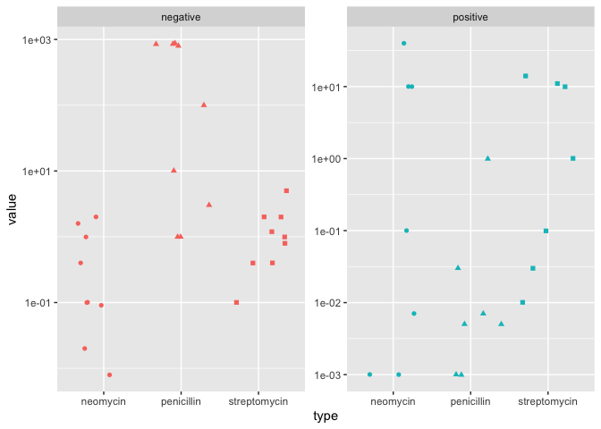
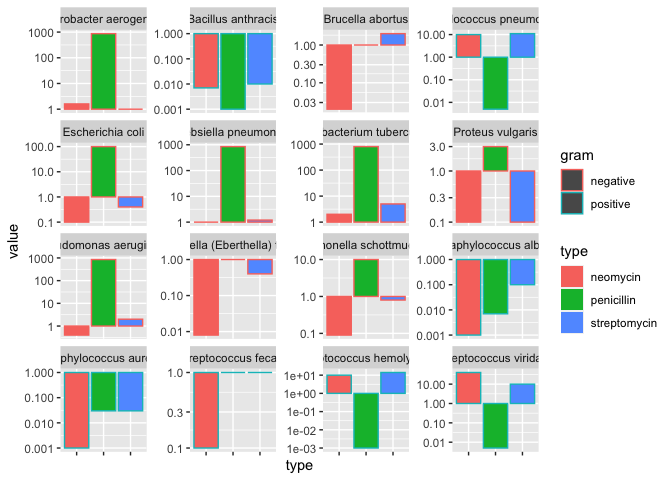
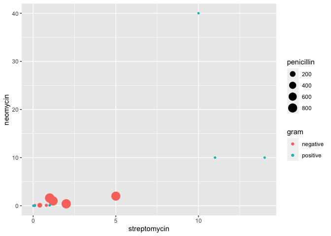
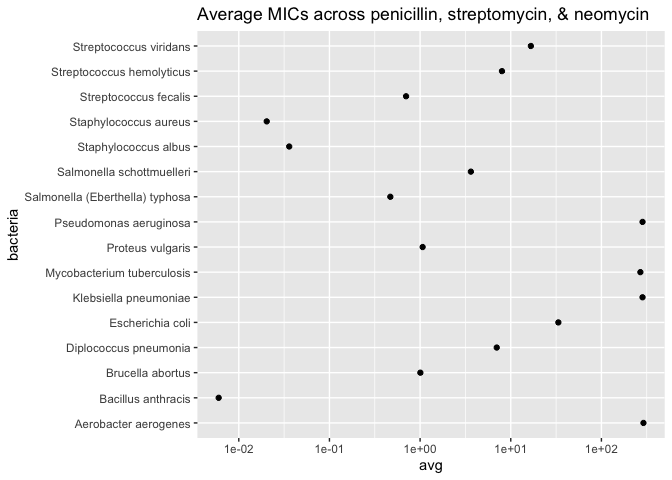
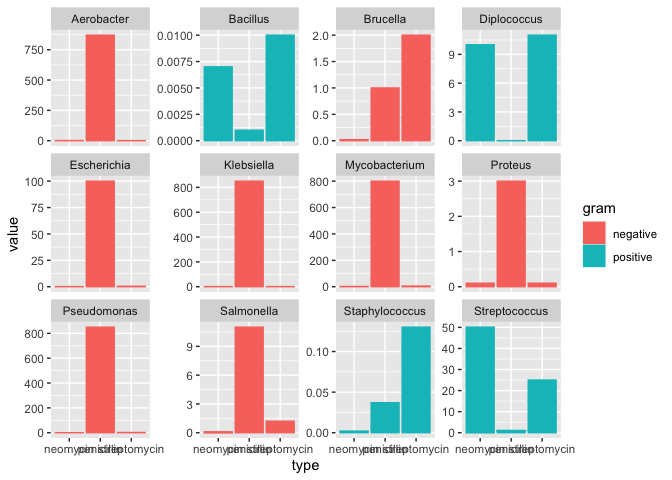

Antibiotics
================
(Lily Jiang)
2022-3-5

*Purpose*: Creating effective data visualizations is an *iterative*
process; very rarely will the first graph you make be the most
effective. The most effective thing you can do to be successful in this
iterative process is to *try multiple graphs* of the same data.

Furthermore, judging the effectiveness of a visual is completely
dependent on *the question you are trying to answer*. A visual that is
totally ineffective for one question may be perfect for answering a
different question.

In this challenge, you will practice *iterating* on data visualization,
and will anchor the *assessment* of your visuals using two different
questions.

*Note*: Please complete your initial visual design **alone**. Work on
both of your graphs alone, and save a version to your repo *before*
coming together with your team. This way you can all bring a diversity
of ideas to the table!

<!-- include-rubric -->

# Grading Rubric

<!-- -------------------------------------------------- -->

Unlike exercises, **challenges will be graded**. The following rubrics
define how you will be graded, both on an individual and team basis.

## Individual

<!-- ------------------------- -->

| Category    | Needs Improvement                                                                                                | Satisfactory                                                                                                               |
|-------------|------------------------------------------------------------------------------------------------------------------|----------------------------------------------------------------------------------------------------------------------------|
| Effort      | Some task **q**’s left unattempted                                                                               | All task **q**’s attempted                                                                                                 |
| Observed    | Did not document observations, or observations incorrect                                                         | Documented correct observations based on analysis                                                                          |
| Supported   | Some observations not clearly supported by analysis                                                              | All observations clearly supported by analysis (table, graph, etc.)                                                        |
| Assessed    | Observations include claims not supported by the data, or reflect a level of certainty not warranted by the data | Observations are appropriately qualified by the quality & relevance of the data and (in)conclusiveness of the support      |
| Specified   | Uses the phrase “more data are necessary” without clarification                                                  | Any statement that “more data are necessary” specifies which *specific* data are needed to answer what *specific* question |
| Code Styled | Violations of the [style guide](https://style.tidyverse.org/) hinder readability                                 | Code sufficiently close to the [style guide](https://style.tidyverse.org/)                                                 |

## Due Date

<!-- ------------------------- -->

All the deliverables stated in the rubrics above are due **at midnight**
before the day of the class discussion of the challenge. See the
[Syllabus](https://docs.google.com/document/d/1qeP6DUS8Djq_A0HMllMqsSqX3a9dbcx1/edit?usp=sharing&ouid=110386251748498665069&rtpof=true&sd=true)
for more information.

``` r
library(tidyverse)
```

    ## ── Attaching packages ─────────────────────────────────────── tidyverse 1.3.2 ──
    ## ✔ ggplot2 3.4.0      ✔ purrr   1.0.1 
    ## ✔ tibble  3.1.8      ✔ dplyr   1.0.10
    ## ✔ tidyr   1.2.1      ✔ stringr 1.5.0 
    ## ✔ readr   2.1.3      ✔ forcats 0.5.2 
    ## ── Conflicts ────────────────────────────────────────── tidyverse_conflicts() ──
    ## ✖ dplyr::filter() masks stats::filter()
    ## ✖ dplyr::lag()    masks stats::lag()

``` r
library(ggrepel)
```

*Background*: The data\[1\] we study in this challenge report the
[*minimum inhibitory
concentration*](https://en.wikipedia.org/wiki/Minimum_inhibitory_concentration)
(MIC) of three drugs for different bacteria. The smaller the MIC for a
given drug and bacteria pair, the more practical the drug is for
treating that particular bacteria. An MIC value of *at most* 0.1 is
considered necessary for treating human patients.

These data report MIC values for three antibiotics—penicillin,
streptomycin, and neomycin—on 16 bacteria. Bacteria are categorized into
a genus based on a number of features, including their resistance to
antibiotics.

``` r
## NOTE: If you extracted all challenges to the same location,
## you shouldn't have to change this filename
filename <- "./data/antibiotics.csv"

## Load the data
df_antibiotics <- read_csv(filename)
```

    ## Rows: 16 Columns: 5
    ## ── Column specification ────────────────────────────────────────────────────────
    ## Delimiter: ","
    ## chr (2): bacteria, gram
    ## dbl (3): penicillin, streptomycin, neomycin
    ## 
    ## ℹ Use `spec()` to retrieve the full column specification for this data.
    ## ℹ Specify the column types or set `show_col_types = FALSE` to quiet this message.

``` r
df_antibiotics %>% knitr::kable()
```

| bacteria                        | penicillin | streptomycin | neomycin | gram     |
|:--------------------------------|-----------:|-------------:|---------:|:---------|
| Aerobacter aerogenes            |    870.000 |         1.00 |    1.600 | negative |
| Brucella abortus                |      1.000 |         2.00 |    0.020 | negative |
| Bacillus anthracis              |      0.001 |         0.01 |    0.007 | positive |
| Diplococcus pneumonia           |      0.005 |        11.00 |   10.000 | positive |
| Escherichia coli                |    100.000 |         0.40 |    0.100 | negative |
| Klebsiella pneumoniae           |    850.000 |         1.20 |    1.000 | negative |
| Mycobacterium tuberculosis      |    800.000 |         5.00 |    2.000 | negative |
| Proteus vulgaris                |      3.000 |         0.10 |    0.100 | negative |
| Pseudomonas aeruginosa          |    850.000 |         2.00 |    0.400 | negative |
| Salmonella (Eberthella) typhosa |      1.000 |         0.40 |    0.008 | negative |
| Salmonella schottmuelleri       |     10.000 |         0.80 |    0.090 | negative |
| Staphylococcus albus            |      0.007 |         0.10 |    0.001 | positive |
| Staphylococcus aureus           |      0.030 |         0.03 |    0.001 | positive |
| Streptococcus fecalis           |      1.000 |         1.00 |    0.100 | positive |
| Streptococcus hemolyticus       |      0.001 |        14.00 |   10.000 | positive |
| Streptococcus viridans          |      0.005 |        10.00 |   40.000 | positive |

# Visualization

<!-- -------------------------------------------------- -->

### **q1** Prototype 5 visuals

To start, construct **5 qualitatively different visualizations of the
data** `df_antibiotics`. These **cannot** be simple variations on the
same graph; for instance, if two of your visuals could be made identical
by calling `coord_flip()`, then these are *not* qualitatively different.

For all five of the visuals, you must show information on *all 16
bacteria*. For the first two visuals, you must *show all variables*.

*Hint 1*: Try working quickly on this part; come up with a bunch of
ideas, and don’t fixate on any one idea for too long. You will have a
chance to refine later in this challenge.

*Hint 2*: The data `df_antibiotics` are in a *wide* format; it may be
helpful to `pivot_longer()` the data to make certain visuals easier to
construct.

#### Visual 1 (All variables)

In this visual you must show *all three* effectiveness values for *all
16 bacteria*. You must also show whether or not each bacterium is Gram
positive or negative.

``` r
df_antibiotics %>%
  pivot_longer(
    cols = c(penicillin, streptomycin, neomycin),
    names_to = "type",
    values_to = "value"
  ) %>%
  ggplot() +
  geom_jitter(aes(x = type, y = value, color = gram, shape = type)) +
  facet_wrap(~gram, scales = "free_y") +
  scale_y_log10() +
  theme(legend.position = "none")
```

<!-- -->

#### Visual 2 (All variables)

In this visual you must show *all three* effectiveness values for *all
16 bacteria*. You must also show whether or not each bacterium is Gram
positive or negative.

Note that your visual must be *qualitatively different* from *all* of
your other visuals.

``` r
df_antibiotics %>%
  pivot_longer(
    cols = c(penicillin, streptomycin, neomycin),
    names_to = "type",
    values_to = "value"
  ) %>%
  ggplot() +
  geom_col(aes(x = type, y = value, color = gram, fill = type)) +
  scale_y_log10() +
  facet_wrap(~bacteria, scales = "free_y") +
  theme(axis.text.x=element_blank())
```

<!-- -->

#### Visual 3 (Some variables)

In this visual you may show a *subset* of the variables (`penicillin`,
`streptomycin`, `neomycin`, `gram`), but you must still show *all 16
bacteria*.

Note that your visual must be *qualitatively different* from *all* of
your other visuals.

``` r
df_antibiotics %>%
  ggplot() +
  geom_point(aes(x = streptomycin, y = neomycin, color = gram, size = penicillin))
```

<!-- -->

#### Visual 4 (Some variables)

In this visual you may show a *subset* of the variables (`penicillin`,
`streptomycin`, `neomycin`, `gram`), but you must still show *all 16
bacteria*.

Note that your visual must be *qualitatively different* from *all* of
your other visuals.

``` r
df_antibiotics %>%
  mutate(avg = rowSums(df_antibiotics[, c(2, 3, 4)], na.rm=TRUE) / 3) %>%
  ggplot() +
  geom_point(aes(x = bacteria, y = avg)) +
  scale_y_log10() +
  coord_flip() +
  ggtitle("Average MICs across penicillin, streptomycin, & neomycin")
```

<!-- -->

#### Visual 5 (Some variables)

In this visual you may show a *subset* of the variables (`penicillin`,
`streptomycin`, `neomycin`, `gram`), but you must still show *all 16
bacteria*.

Note that your visual must be *qualitatively different* from *all* of
your other visuals.

``` r
df_antibiotics %>%
  pivot_longer(
    cols = c(penicillin, streptomycin, neomycin),
    names_to = "type",
    values_to = "value"
  ) %>%
  separate(bacteria, c("genus", "species"), " ") %>%
  ggplot() +
  geom_col(aes(x = type, y = value, color = gram, fill = gram)) +
  facet_wrap(~genus, scales = "free_y")
```

    ## Warning: Expected 2 pieces. Additional pieces discarded in 3 rows [28, 29, 30].

<!-- -->

### **q2** Assess your visuals

There are **two questions** below; use your five visuals to help answer
both Guiding Questions. Note that you must also identify which of your
five visuals were most helpful in answering the questions.

*Hint 1*: It’s possible that *none* of your visuals is effective in
answering the questions below. You may need to revise one or more of
your visuals to answer the questions below!

*Hint 2*: It’s **highly unlikely** that the same visual is the most
effective at helping answer both guiding questions. **Use this as an
opportunity to think about why this is.**

#### Guiding Question 1

> How do the three antibiotics vary in their effectiveness against
> bacteria of different genera and Gram stain?

- What is your response to the question above?

  - Penicillin is extremely ineffective against 4 strains of negative
    bacteria (much more so than any other antibiotic and gram stain
    combination). This is indicated by the high MIC values that are well
    over 750. In comparison to the rest of the data (most with MIC
    values under 100), this is massive.

  - On the other hand, penicillin appears to be quite effective against
    all the positively-stained bacteria it was tested on. All points
    except for one fall below the threshold of 0.1, which counts as
    effective for human treatment. The remaining point falls at/near 1,
    which is still low compared to the negative gram values even if it
    isn’t suitable for human treatment.

  - On negatively-stained bacteria, Streptomycin is not suitable to
    treat any of the bacteria. All of the points except 1 fall above
    0.1. One point does fall extremely close to 0.1, but because I can’t
    accurately determine if it is above or below I don’t want to jump to
    any conclusions.

  - Tested on positively stained bacteria, Streptomycin has only 2
    points falling below 0.1. The majority (4 points) definitively fall
    above this threshold. One point falls extremely close to the
    threshold, and based on my eyeballing appears to be above it. But
    because it is not obvious, I am not going to make any solid
    conclusions about it. As most of the points here are above the
    threshold, I would say Streptomycin is not super effective against
    the positive-stain bacteria overall.

  - Neomycin is only somewhat effective for both negatively- and
    positively-stained bacteria, which I say because there is almost an
    even split between points falling above/below 0.1 for both. A few
    points do visually fall on the 0.1 marker: two for negative bacteria
    and one for positive. Because of this, it is hard to tell if
    Neomycin meets the threshold requirements to be considered effective
    against these bacteria or not.

- Which of your visuals above (1 through 5) is **most effective** at
  helping to answer this question? Why?

  - Visual 1 was most effective at helping me answer this question. It
    separated by both the three antibiotics and the gram stain, which
    allowed me to then easily see each combination’s effectiveness
    across the bacteria it was tested on. However, I didn’t add anything
    within the visual 1 plot to distinguish by genus, which is why I
    tweaked my visual 5 to directly assist with this.

#### Guiding Question 2

In 1974 *Diplococcus pneumoniae* was renamed *Streptococcus pneumoniae*,
and in 1984 *Streptococcus fecalis* was renamed *Enterococcus fecalis*
\[2\].

> Why was *Diplococcus pneumoniae* was renamed *Streptococcus
> pneumoniae*?

*Observations*

- What is your response to the question above?

  - Perhaps because *Diplococcus pneumoniae* shares a similar pattern of
    MIC values across the three antibiotics as *Streptococcus
    hemolyticus* and *Streptococcus viridans*. In fact, *Diplococcus
    pneumoniae* not only has a similar pattern as *Streptococcus
    hemolyticus*, but they also have similar *values*. All three of
    these bacteria have quite high MIC values for streptomycin and
    neomycin, and a low MIC value for penicillin. It makes sense that
    scientists would want to group similarly-behaving bacteria by name,
    and therefore change *Diplococcus pneumoniae* to be *Streptococcus
    pneumoniae*.

- Which of your visuals above (1 through 5) is **most effective** at
  helping to answer this question? Why?

  - \#2, because it allows me to see the patterns that each specific
    bacteria exhibits. Because I used a column plot, the blocks of color
    make it really easy to see which bacteria behave similarly. This
    allowed me to quickly notice that *Diplococcus pneumoniae* has a
    similar behavior to all three antibiotics as *Streptococcus
    hemolyticus* and *Streptococcus viridans* do.

# References

<!-- -------------------------------------------------- -->

\[1\] Neomycin in skin infections: A new topical antibiotic with wide
antibacterial range and rarely sensitizing. Scope. 1951;3(5):4-7.

\[2\] Wainer and Lysen, “That’s Funny…” *American Scientist* (2009)
[link](https://www.americanscientist.org/article/thats-funny)
