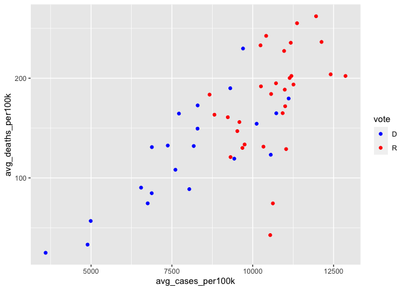
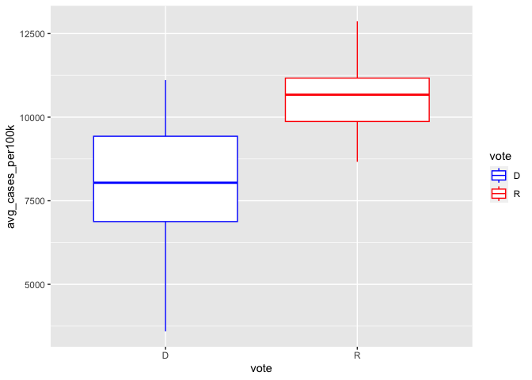
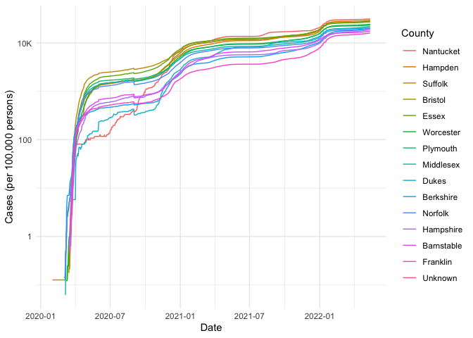

COVID-19
================
Lily Jiang
2023-03-19

- [Grading Rubric](#grading-rubric)
  - [Individual](#individual)
  - [Due Date](#due-date)
- [The Big Picture](#the-big-picture)
- [Get the Data](#get-the-data)
  - [Navigating the Census Bureau](#navigating-the-census-bureau)
    - [**q1** Load Table `B01003` into the following tibble. Make sure
      the column names are
      `id, Geographic Area Name, Estimate!!Total, Margin of Error!!Total`.](#q1-load-table-b01003-into-the-following-tibble-make-sure-the-column-names-are-id-geographic-area-name-estimatetotal-margin-of-errortotal)
  - [Automated Download of NYT Data](#automated-download-of-nyt-data)
    - [**q2** Visit the NYT GitHub repo and find the URL for the **raw**
      US County-level data. Assign that URL as a string to the variable
      below.](#q2-visit-the-nyt-github-repo-and-find-the-url-for-the-raw-us-county-level-data-assign-that-url-as-a-string-to-the-variable-below)
- [Join the Data](#join-the-data)
  - [**q3** Process the `id` column of `df_pop` to create a `fips`
    column.](#q3-process-the-id-column-of-df_pop-to-create-a-fips-column)
  - [**q4** Join `df_covid` with `df_q3` by the `fips` column. Use the
    proper type of join to preserve *only* the rows in
    `df_covid`.](#q4-join-df_covid-with-df_q3-by-the-fips-column-use-the-proper-type-of-join-to-preserve-only-the-rows-in-df_covid)
- [Analyze](#analyze)
  - [Normalize](#normalize)
    - [**q5** Use the `population` estimates in `df_data` to normalize
      `cases` and `deaths` to produce per 100,000 counts \[3\]. Store
      these values in the columns `cases_per100k` and
      `deaths_per100k`.](#q5-use-the-population-estimates-in-df_data-to-normalize-cases-and-deaths-to-produce-per-100000-counts-3-store-these-values-in-the-columns-cases_per100k-and-deaths_per100k)
  - [Guided EDA](#guided-eda)
    - [**q6** Compute the mean and standard deviation for
      `cases_per100k` and
      `deaths_per100k`.](#q6-compute-the-mean-and-standard-deviation-for-cases_per100k-and-deaths_per100k)
    - [**q7** Find the top 10 counties in terms of `cases_per100k`, and
      the top 10 in terms of `deaths_per100k`. Report the population of
      each county along with the per-100,000 counts. Compare the counts
      against the mean values you found in q6. Note any
      observations.](#q7-find-the-top-10-counties-in-terms-of-cases_per100k-and-the-top-10-in-terms-of-deaths_per100k-report-the-population-of-each-county-along-with-the-per-100000-counts-compare-the-counts-against-the-mean-values-you-found-in-q6-note-any-observations)
  - [Self-directed EDA](#self-directed-eda)
    - [**q8** Drive your own ship: You’ve just put together a very rich
      dataset; you now get to explore! Pick your own direction and
      generate at least one punchline figure to document an interesting
      finding. I give a couple tips & ideas
      below:](#q8-drive-your-own-ship-youve-just-put-together-a-very-rich-dataset-you-now-get-to-explore-pick-your-own-direction-and-generate-at-least-one-punchline-figure-to-document-an-interesting-finding-i-give-a-couple-tips--ideas-below)
    - [Ideas](#ideas)
    - [Aside: Some visualization
      tricks](#aside-some-visualization-tricks)
    - [Geographic exceptions](#geographic-exceptions)
- [Notes](#notes)

*Purpose*: In this challenge, you’ll learn how to navigate the U.S.
Census Bureau website, programmatically download data from the internet,
and perform a county-level population-weighted analysis of current
COVID-19 trends. This will give you the base for a very deep
investigation of COVID-19, which we’ll build upon for Project 1.

<!-- include-rubric -->

# Grading Rubric

<!-- -------------------------------------------------- -->

Unlike exercises, **challenges will be graded**. The following rubrics
define how you will be graded, both on an individual and team basis.

## Individual

<!-- ------------------------- -->

| Category    | Needs Improvement                                                                                                | Satisfactory                                                                                                               |
|-------------|------------------------------------------------------------------------------------------------------------------|----------------------------------------------------------------------------------------------------------------------------|
| Effort      | Some task **q**’s left unattempted                                                                               | All task **q**’s attempted                                                                                                 |
| Observed    | Did not document observations, or observations incorrect                                                         | Documented correct observations based on analysis                                                                          |
| Supported   | Some observations not clearly supported by analysis                                                              | All observations clearly supported by analysis (table, graph, etc.)                                                        |
| Assessed    | Observations include claims not supported by the data, or reflect a level of certainty not warranted by the data | Observations are appropriately qualified by the quality & relevance of the data and (in)conclusiveness of the support      |
| Specified   | Uses the phrase “more data are necessary” without clarification                                                  | Any statement that “more data are necessary” specifies which *specific* data are needed to answer what *specific* question |
| Code Styled | Violations of the [style guide](https://style.tidyverse.org/) hinder readability                                 | Code sufficiently close to the [style guide](https://style.tidyverse.org/)                                                 |

## Due Date

<!-- ------------------------- -->

All the deliverables stated in the rubrics above are due **at midnight**
before the day of the class discussion of the challenge. See the
[Syllabus](https://docs.google.com/document/d/1qeP6DUS8Djq_A0HMllMqsSqX3a9dbcx1/edit?usp=sharing&ouid=110386251748498665069&rtpof=true&sd=true)
for more information.

``` r
library(tidyverse)
```

    ## ── Attaching packages ─────────────────────────────────────── tidyverse 1.3.2 ──
    ## ✔ ggplot2 3.4.0      ✔ purrr   1.0.1 
    ## ✔ tibble  3.1.8      ✔ dplyr   1.0.10
    ## ✔ tidyr   1.2.1      ✔ stringr 1.5.0 
    ## ✔ readr   2.1.3      ✔ forcats 0.5.2 
    ## ── Conflicts ────────────────────────────────────────── tidyverse_conflicts() ──
    ## ✖ dplyr::filter() masks stats::filter()
    ## ✖ dplyr::lag()    masks stats::lag()

``` r
library(readxl) # For reading Excel sheets
library(dplyr)
```

*Background*:
[COVID-19](https://en.wikipedia.org/wiki/Coronavirus_disease_2019) is
the disease caused by the virus SARS-CoV-2. In 2020 it became a global
pandemic, leading to huge loss of life and tremendous disruption to
society. The New York Times (as of writing) publishes up-to-date data on
the progression of the pandemic across the United States—we will study
these data in this challenge.

*Optional Readings*: I’ve found this [ProPublica
piece](https://www.propublica.org/article/how-to-understand-covid-19-numbers)
on “How to understand COVID-19 numbers” to be very informative!

# The Big Picture

<!-- -------------------------------------------------- -->

We’re about to go through *a lot* of weird steps, so let’s first fix the
big picture firmly in mind:

We want to study COVID-19 in terms of data: both case counts (number of
infections) and deaths. We’re going to do a county-level analysis in
order to get a high-resolution view of the pandemic. Since US counties
can vary widely in terms of their population, we’ll need population
estimates in order to compute infection rates (think back to the
`Titanic` challenge).

That’s the high-level view; now let’s dig into the details.

# Get the Data

<!-- -------------------------------------------------- -->

1.  County-level population estimates (Census Bureau)
2.  County-level COVID-19 counts (New York Times)

## Navigating the Census Bureau

<!-- ------------------------- -->

**Steps**: Our objective is to find the 2018 American Community
Survey\[1\] (ACS) Total Population estimates, disaggregated by counties.
To check your results, this is Table `B01003`.

1.  Go to [data.census.gov](data.census.gov).
2.  Scroll down and click `View Tables`.
3.  Apply filters to find the ACS **Total Population** estimates,
    disaggregated by counties. I used the filters:

- `Topics > Populations and People > Counts, Estimates, and Projections > Population Total`
- `Geography > County > All counties in United States`

5.  Select the **Total Population** table and click the `Download`
    button to download the data; make sure to select the 2018 5-year
    estimates.
6.  Unzip and move the data to your `challenges/data` folder.

- Note that the data will have a crazy-long filename like
  `ACSDT5Y2018.B01003_data_with_overlays_2020-07-26T094857.csv`. That’s
  because metadata is stored in the filename, such as the year of the
  estimate (`Y2018`) and my access date (`2020-07-26`). **Your filename
  will vary based on when you download the data**, so make sure to copy
  the filename that corresponds to what you downloaded!

### **q1** Load Table `B01003` into the following tibble. Make sure the column names are `id, Geographic Area Name, Estimate!!Total, Margin of Error!!Total`.

*Hint*: You will need to use the `skip` keyword when loading these data!

``` r
df_pop <- read_csv("data/ACSDT5Y2018.B01003-Data.csv") %>%
  rename("id" = "Geography") %>%
  select('id', 'Geographic Area Name', 'Estimate!!Total', 'Margin of Error!!Total')
```

    ## New names:
    ## Rows: 3220 Columns: 7
    ## ── Column specification
    ## ──────────────────────────────────────────────────────── Delimiter: "," chr
    ## (5): Geography, Geographic Area Name, Annotation of Estimate!!Total, Mar... dbl
    ## (1): Estimate!!Total lgl (1): ...7
    ## ℹ Use `spec()` to retrieve the full column specification for this data. ℹ
    ## Specify the column types or set `show_col_types = FALSE` to quiet this message.
    ## • `` -> `...7`

``` r
df_pop
```

    ## # A tibble: 3,220 × 4
    ##    id             `Geographic Area Name`   `Estimate!!Total` Margin of Error!!…¹
    ##    <chr>          <chr>                                <dbl> <chr>              
    ##  1 0500000US01001 Autauga County, Alabama              55200 *****              
    ##  2 0500000US01003 Baldwin County, Alabama             208107 *****              
    ##  3 0500000US01005 Barbour County, Alabama              25782 *****              
    ##  4 0500000US01007 Bibb County, Alabama                 22527 *****              
    ##  5 0500000US01009 Blount County, Alabama               57645 *****              
    ##  6 0500000US01011 Bullock County, Alabama              10352 *****              
    ##  7 0500000US01013 Butler County, Alabama               20025 *****              
    ##  8 0500000US01015 Calhoun County, Alabama             115098 *****              
    ##  9 0500000US01017 Chambers County, Alabama             33826 *****              
    ## 10 0500000US01019 Cherokee County, Alabama             25853 *****              
    ## # … with 3,210 more rows, and abbreviated variable name
    ## #   ¹​`Margin of Error!!Total`

*Note*: You can find information on 1-year, 3-year, and 5-year estimates
[here](https://www.census.gov/programs-surveys/acs/guidance/estimates.html).
The punchline is that 5-year estimates are more reliable but less
current.

## Automated Download of NYT Data

<!-- ------------------------- -->

ACS 5-year estimates don’t change all that often, but the COVID-19 data
are changing rapidly. To that end, it would be nice to be able to
*programmatically* download the most recent data for analysis; that way
we can update our analysis whenever we want simply by re-running our
notebook. This next problem will have you set up such a pipeline.

The New York Times is publishing up-to-date data on COVID-19 on
[GitHub](https://github.com/nytimes/covid-19-data).

### **q2** Visit the NYT [GitHub](https://github.com/nytimes/covid-19-data) repo and find the URL for the **raw** US County-level data. Assign that URL as a string to the variable below.

``` r
url_counties <- "https://raw.githubusercontent.com/nytimes/covid-19-data/master/us-counties.csv"
```

Once you have the url, the following code will download a local copy of
the data, then load the data into R.

``` r
## NOTE: No need to change this; just execute
## Set the filename of the data to download
filename_nyt <- "./data/nyt_counties.csv"

## Download the data locally
curl::curl_download(
        url_counties,
        destfile = filename_nyt
      )

## Loads the downloaded csv
df_covid <- read_csv(filename_nyt)
```

    ## Rows: 2502832 Columns: 6
    ## ── Column specification ────────────────────────────────────────────────────────
    ## Delimiter: ","
    ## chr  (3): county, state, fips
    ## dbl  (2): cases, deaths
    ## date (1): date
    ## 
    ## ℹ Use `spec()` to retrieve the full column specification for this data.
    ## ℹ Specify the column types or set `show_col_types = FALSE` to quiet this message.

You can now re-run the chunk above (or the entire notebook) to pull the
most recent version of the data. Thus you can periodically re-run this
notebook to check in on the pandemic as it evolves.

*Note*: You should feel free to copy-paste the code above for your own
future projects!

# Join the Data

<!-- -------------------------------------------------- -->

To get a sense of our task, let’s take a glimpse at our two data
sources.

``` r
## NOTE: No need to change this; just execute
df_pop %>% glimpse
```

    ## Rows: 3,220
    ## Columns: 4
    ## $ id                       <chr> "0500000US01001", "0500000US01003", "0500000U…
    ## $ `Geographic Area Name`   <chr> "Autauga County, Alabama", "Baldwin County, A…
    ## $ `Estimate!!Total`        <dbl> 55200, 208107, 25782, 22527, 57645, 10352, 20…
    ## $ `Margin of Error!!Total` <chr> "*****", "*****", "*****", "*****", "*****", …

``` r
df_covid %>% glimpse
```

    ## Rows: 2,502,832
    ## Columns: 6
    ## $ date   <date> 2020-01-21, 2020-01-22, 2020-01-23, 2020-01-24, 2020-01-24, 20…
    ## $ county <chr> "Snohomish", "Snohomish", "Snohomish", "Cook", "Snohomish", "Or…
    ## $ state  <chr> "Washington", "Washington", "Washington", "Illinois", "Washingt…
    ## $ fips   <chr> "53061", "53061", "53061", "17031", "53061", "06059", "17031", …
    ## $ cases  <dbl> 1, 1, 1, 1, 1, 1, 1, 1, 1, 1, 1, 1, 1, 1, 1, 1, 1, 1, 1, 1, 1, …
    ## $ deaths <dbl> 0, 0, 0, 0, 0, 0, 0, 0, 0, 0, 0, 0, 0, 0, 0, 0, 0, 0, 0, 0, 0, …

To join these datasets, we’ll need to use [FIPS county
codes](https://en.wikipedia.org/wiki/FIPS_county_code).\[2\] The last
`5` digits of the `id` column in `df_pop` is the FIPS county code, while
the NYT data `df_covid` already contains the `fips`.

### **q3** Process the `id` column of `df_pop` to create a `fips` column.

``` r
df_q3 <- df_pop %>%
  separate(col = id, into = c("id","fips"), sep = -5)
df_q3
```

    ## # A tibble: 3,220 × 5
    ##    id        fips  `Geographic Area Name`   `Estimate!!Total` Margin of Error!…¹
    ##    <chr>     <chr> <chr>                                <dbl> <chr>             
    ##  1 0500000US 01001 Autauga County, Alabama              55200 *****             
    ##  2 0500000US 01003 Baldwin County, Alabama             208107 *****             
    ##  3 0500000US 01005 Barbour County, Alabama              25782 *****             
    ##  4 0500000US 01007 Bibb County, Alabama                 22527 *****             
    ##  5 0500000US 01009 Blount County, Alabama               57645 *****             
    ##  6 0500000US 01011 Bullock County, Alabama              10352 *****             
    ##  7 0500000US 01013 Butler County, Alabama               20025 *****             
    ##  8 0500000US 01015 Calhoun County, Alabama             115098 *****             
    ##  9 0500000US 01017 Chambers County, Alabama             33826 *****             
    ## 10 0500000US 01019 Cherokee County, Alabama             25853 *****             
    ## # … with 3,210 more rows, and abbreviated variable name
    ## #   ¹​`Margin of Error!!Total`

Use the following test to check your answer.

``` r
## NOTE: No need to change this
## Check known county
assertthat::assert_that(
              (df_q3 %>%
              filter(str_detect(`Geographic Area Name`, "Autauga County")) %>%
              pull(fips)) == "01001"
            )
```

    ## [1] TRUE

``` r
print("Very good!")
```

    ## [1] "Very good!"

### **q4** Join `df_covid` with `df_q3` by the `fips` column. Use the proper type of join to preserve *only* the rows in `df_covid`.

``` r
df_q4 <- df_covid %>%
  left_join(df_q3, by="fips")
df_q4
```

    ## # A tibble: 2,502,832 × 10
    ##    date       county      state fips  cases deaths id    Geogr…¹ Estim…² Margi…³
    ##    <date>     <chr>       <chr> <chr> <dbl>  <dbl> <chr> <chr>     <dbl> <chr>  
    ##  1 2020-01-21 Snohomish   Wash… 53061     1      0 0500… Snohom…  7.87e5 *****  
    ##  2 2020-01-22 Snohomish   Wash… 53061     1      0 0500… Snohom…  7.87e5 *****  
    ##  3 2020-01-23 Snohomish   Wash… 53061     1      0 0500… Snohom…  7.87e5 *****  
    ##  4 2020-01-24 Cook        Illi… 17031     1      0 0500… Cook C…  5.22e6 *****  
    ##  5 2020-01-24 Snohomish   Wash… 53061     1      0 0500… Snohom…  7.87e5 *****  
    ##  6 2020-01-25 Orange      Cali… 06059     1      0 0500… Orange…  3.16e6 *****  
    ##  7 2020-01-25 Cook        Illi… 17031     1      0 0500… Cook C…  5.22e6 *****  
    ##  8 2020-01-25 Snohomish   Wash… 53061     1      0 0500… Snohom…  7.87e5 *****  
    ##  9 2020-01-26 Maricopa    Ariz… 04013     1      0 0500… Marico…  4.25e6 *****  
    ## 10 2020-01-26 Los Angeles Cali… 06037     1      0 0500… Los An…  1.01e7 *****  
    ## # … with 2,502,822 more rows, and abbreviated variable names
    ## #   ¹​`Geographic Area Name`, ²​`Estimate!!Total`, ³​`Margin of Error!!Total`

For convenience, I down-select some columns and produce more convenient
column names.

``` r
## NOTE: No need to change; run this to produce a more convenient tibble
df_data <-
  df_q4 %>%
  select(
    date,
    county,
    state,
    fips,
    cases,
    deaths,
    population = `Estimate!!Total`
  )
```

# Analyze

<!-- -------------------------------------------------- -->

Now that we’ve done the hard work of loading and wrangling the data, we
can finally start our analysis. Our first step will be to produce county
population-normalized cases and death counts. Then we will explore the
data.

## Normalize

<!-- ------------------------- -->

### **q5** Use the `population` estimates in `df_data` to normalize `cases` and `deaths` to produce per 100,000 counts \[3\]. Store these values in the columns `cases_per100k` and `deaths_per100k`.

``` r
df_normalized <- df_data %>%
  mutate(
    cases_per100k = (cases/population)*100000,
    deaths_per100k = (deaths/population)*100000
  )
df_normalized
```

    ## # A tibble: 2,502,832 × 9
    ##    date       county      state      fips  cases deaths popula…¹ cases…² death…³
    ##    <date>     <chr>       <chr>      <chr> <dbl>  <dbl>    <dbl>   <dbl>   <dbl>
    ##  1 2020-01-21 Snohomish   Washington 53061     1      0   786620 0.127         0
    ##  2 2020-01-22 Snohomish   Washington 53061     1      0   786620 0.127         0
    ##  3 2020-01-23 Snohomish   Washington 53061     1      0   786620 0.127         0
    ##  4 2020-01-24 Cook        Illinois   17031     1      0  5223719 0.0191        0
    ##  5 2020-01-24 Snohomish   Washington 53061     1      0   786620 0.127         0
    ##  6 2020-01-25 Orange      California 06059     1      0  3164182 0.0316        0
    ##  7 2020-01-25 Cook        Illinois   17031     1      0  5223719 0.0191        0
    ##  8 2020-01-25 Snohomish   Washington 53061     1      0   786620 0.127         0
    ##  9 2020-01-26 Maricopa    Arizona    04013     1      0  4253913 0.0235        0
    ## 10 2020-01-26 Los Angeles California 06037     1      0 10098052 0.00990       0
    ## # … with 2,502,822 more rows, and abbreviated variable names ¹​population,
    ## #   ²​cases_per100k, ³​deaths_per100k

You may use the following test to check your work.

``` r
## NOTE: No need to change this
## Check known county data
if (any(df_normalized %>% pull(date) %>% str_detect(., "2020-01-21"))) {
  assertthat::assert_that(TRUE)
} else {
  print(str_c(
    "Date 2020-01-21 not found; did you download the historical data (correct),",
    "or just the most recent data (incorrect)?",
    sep = " "
  ))
  assertthat::assert_that(FALSE)
}
```

    ## [1] TRUE

``` r
assertthat::assert_that(
              abs(df_normalized %>%
               filter(
                 str_detect(county, "Snohomish"),
                 date == "2020-01-21"
               ) %>%
              pull(cases_per100k) - 0.127) < 1e-3
            )
```

    ## [1] TRUE

``` r
assertthat::assert_that(
              abs(df_normalized %>%
               filter(
                 str_detect(county, "Snohomish"),
                 date == "2020-01-21"
               ) %>%
              pull(deaths_per100k) - 0) < 1e-3
            )
```

    ## [1] TRUE

``` r
print("Excellent!")
```

    ## [1] "Excellent!"

## Guided EDA

<!-- ------------------------- -->

Before turning you loose, let’s complete a couple guided EDA tasks.

### **q6** Compute the mean and standard deviation for `cases_per100k` and `deaths_per100k`.

``` r
df_normalized %>%
  summarise(
    mean_cases_per100k = mean(cases_per100k, na.rm = TRUE),
    sd_cases_per100k = sd(cases_per100k, na.rm = TRUE),
    mean_deaths_per100k = mean(deaths_per100k, na.rm = TRUE),
    sd_deaths_per100k = sd(deaths_per100k, na.rm = TRUE)
  )
```

    ## # A tibble: 1 × 4
    ##   mean_cases_per100k sd_cases_per100k mean_deaths_per100k sd_deaths_per100k
    ##                <dbl>            <dbl>               <dbl>             <dbl>
    ## 1              9975.            8449.                174.              159.

### **q7** Find the top 10 counties in terms of `cases_per100k`, and the top 10 in terms of `deaths_per100k`. Report the population of each county along with the per-100,000 counts. Compare the counts against the mean values you found in q6. Note any observations.

``` r
populations_by_county <- df_normalized %>%
  group_by(county) %>%
  summarise(avg_pop = mean(population))

top_cases <- df_normalized %>%
  group_by(county) %>%
  summarise(avg_cases_per100k = mean(cases_per100k)) %>%
  left_join(populations_by_county, by="county") %>%
  mutate(rank = min_rank(desc(avg_cases_per100k))) %>%
  filter(rank <= 10) %>%
  arrange(rank) %>%
  select(-rank)
top_cases
```

    ## # A tibble: 10 × 3
    ##    county               avg_cases_per100k avg_pop
    ##    <chr>                            <dbl>   <dbl>
    ##  1 Loving                          38233.     102
    ##  2 Chattahoochee                   33881.   10767
    ##  3 Crowley                         29041.    5630
    ##  4 Trousdale                       25871.    9573
    ##  5 Bent                            21434.    5809
    ##  6 Dimmit                          21279.   10663
    ##  7 Bethel Census Area              21215.   18040
    ##  8 Norton                          20270.    5486
    ##  9 Kusilvak Census Area            19188.    8198
    ## 10 Buena Vista                     18770.   20260

``` r
top_deaths <- df_normalized %>%
  group_by(county) %>%
  summarise(avg_deaths_per100k = mean(deaths_per100k)) %>%
  left_join(populations_by_county, by="county") %>%
  mutate(rank = min_rank(desc(avg_deaths_per100k))) %>%
  filter(rank <= 10) %>%
  arrange(rank) %>%
  select(-rank)
top_deaths
```

    ## # A tibble: 10 × 3
    ##    county         avg_deaths_per100k avg_pop
    ##    <chr>                       <dbl>   <dbl>
    ##  1 McMullen                     729.     662
    ##  2 Galax city                   666.    6638
    ##  3 Emporia city                 633.    5381
    ##  4 Jerauld                      631.    2029
    ##  5 Gove                         595.    2619
    ##  6 Gregory                      558.    4201
    ##  7 Dickey                       535.    4970
    ##  8 Foard                        527.    1408
    ##  9 McKinley                     527.   72849
    ## 10 East Feliciana               523.   19499

**Observations**:

- The counties with the highest proportion of cases have around 2-4
  times the number of cases per 100k people than the average county.
- The counties with the highest proportion of deaths have about 3-4
  times the number of deaths per 100k people than the average county.

## Self-directed EDA

<!-- ------------------------- -->

### **q8** Drive your own ship: You’ve just put together a very rich dataset; you now get to explore! Pick your own direction and generate at least one punchline figure to document an interesting finding. I give a couple tips & ideas below:

### Ideas

<!-- ------------------------- -->

- Look for outliers.
- Try web searching for news stories in some of the outlier counties.
- Investigate relationships between county population and counts.
- Do a deep-dive on counties that are important to you (e.g. where you
  or your family live).
- Fix the *geographic exceptions* noted below to study New York City.
- Your own idea!

``` r
election_2016 <- tribble(
  ~state, ~vote,
  "Alabama", "R",
  "Alaska", "R",
  "Arizona", "R",
  "Arkansas", "R",
  "California", "D",
  "Colorado", "D",
  "Connecticut", "D",
  "Delaware", "D",
  "District of Columbia", "D",
  "Florida", "R",
  "Georgia", "R",
  "Hawaii", "D",
  "Idaho", "R",
  "Illinois", "D",
  "Indiana", "R",
  "Iowa", "R",
  "Kansas", "R",
  "Kentucky", "R",
  "Louisiana", "R",
  "Maine", "D",
  "Maryland", "D",
  "Massachusetts", "D",
  "Michigan", "R",
  "Minnesota", "D",
  "Mississippi", "R",
  "Missouri", "R",
  "Montana", "R",
  "Nebraska", "R",
  "Nevada", "D",
  "New Hampshire", "D",
  "New Jersey", "D",
  "New Mexico", "D",
  "New York", "D",
  "North Carolina", "R",
  "North Dakota", "R",
  "Ohio", "R",
  "Oklahoma", "R",
  "Oregon", "D",
  "Pennsylvania", "R",
  "Rhode Island", "D",
  "South Carolina", "R",
  "South Dakota", "R",
  "Tennessee", "R",
  "Texas", "R",
  "Utah", "R",
  "Vermont", "D",
  "Virginia", "D",
  "Washington", "D",
  "West Virginia", "R",
  "Wisconsin", "R",
  "Wyoming", "R"
)

state_covid_and_vote <- df_normalized %>%
  select(state, cases_per100k, deaths_per100k) %>%
  group_by(state) %>%
  drop_na(cases_per100k, deaths_per100k) %>%
  summarise(
    avg_cases_per100k = mean(cases_per100k, na.rm = TRUE),
    avg_deaths_per100k = mean(deaths_per100k, na.rm = TRUE)
  ) %>%
  left_join(election_2016, by="state")

# plotting cases vs. deaths, and identifying by state election results in 2016
# are the trump supporters more covid prone???????
state_covid_and_vote %>%
  ggplot(aes(x = avg_cases_per100k, y = avg_deaths_per100k)) +
  geom_point(aes(color = vote)) +
  scale_color_manual(values = c("R" = "red",
                                "D"="blue")
                                )
```

<!-- -->

``` r
# Extracting the linear regression data
linear_model <- lm(avg_deaths_per100k ~ avg_cases_per100k, data = state_covid_and_vote)
summary(linear_model)
```

    ## 
    ## Call:
    ## lm(formula = avg_deaths_per100k ~ avg_cases_per100k, data = state_covid_and_vote)
    ## 
    ## Residuals:
    ##      Min       1Q   Median       3Q      Max 
    ## -134.920  -22.137   -1.557   23.742   69.825 
    ## 
    ## Coefficients:
    ##                     Estimate Std. Error t value Pr(>|t|)    
    ## (Intercept)       -43.646130  28.111937  -1.553    0.127    
    ## avg_cases_per100k   0.020990   0.002891   7.261 2.62e-09 ***
    ## ---
    ## Signif. codes:  0 '***' 0.001 '**' 0.01 '*' 0.05 '.' 0.1 ' ' 1
    ## 
    ## Residual standard error: 40.67 on 49 degrees of freedom
    ## Multiple R-squared:  0.5183, Adjusted R-squared:  0.5084 
    ## F-statistic: 52.72 on 1 and 49 DF,  p-value: 2.62e-09

``` r
# Directly comparing the spread for cases per 100K between red and blue states
state_covid_and_vote %>%
  ggplot(aes(x = vote)) +
  geom_boxplot(aes(y = avg_cases_per100k, color = vote)) +
  scale_color_manual(values = c("R" = "red",
                                "D"="blue")
                                )
```

<!-- -->

``` r
# Isolating and examining two red-colored outlier points
state_covid_and_vote %>%
  filter(vote == "R") %>%
  filter(avg_deaths_per100k < 100)
```

    ## # A tibble: 2 × 4
    ##   state  avg_cases_per100k avg_deaths_per100k vote 
    ##   <chr>              <dbl>              <dbl> <chr>
    ## 1 Alaska            10541.               42.7 R    
    ## 2 Utah              10622.               74.5 R

``` r
# Isolating and examining the lowest point on the plot, in both axes
state_covid_and_vote %>%
  filter(avg_cases_per100k < 4000)
```

    ## # A tibble: 1 × 4
    ##   state  avg_cases_per100k avg_deaths_per100k vote 
    ##   <chr>              <dbl>              <dbl> <chr>
    ## 1 Hawaii             3596.               24.9 D

Observations:

- Red states proportionally had more COVID cases and deaths compared to
  blue states. This is visible through the plot, where the values that
  lie farther to the right and top are more red, while the values closer
  to the left and bottom are more blue. Additionally, in the boxplot, it
  is clear that the distribution (particularly the mean cases per 100k)
  for Republican states is higher than the distribution for Democrat
  states.

- There is a visible positive correlation between per 100k cases and per
  100k deaths. Upon finding the linear regression summary, this
  correlation has a slope of about `0.021`. This suggests that
  typically, approximately 21 people will die for every 1000 people that
  have COVID.

- There are 2 states that have a large proportion of cases but very few
  deaths. Both of these were Republican-leaning during the 2016
  election, as indicated by the color of the points. Upon exploring this
  (by filtering the `df_normalized` dataset according to what I saw in
  the plot: Republican-leaning and having an `avg_deaths_per100k` less
  than 100). From this, I determined these states to be Alaska and Utah.

- There is one state that has the smallest average cases and deaths per
  100k. Again, I filtered the original dataset according to the features
  of the point I saw on the plot: a blue state, and with an
  `avg_cases_per100k` less than 4000. This narrowed the set down to just
  one state: Hawaii.

- This last observation fascinated me the most, because I know Hawaii to
  be a very tourist-heavy state. During the pandemic, traveling became
  synonymous with the spreading of COVID, so I was intrigued to see why
  Hawaii actually had the lowest cases amongst all the states. After
  doing some research on Hawaii’s travel and COVID policies, I learned
  that **Hawaii was one of the first (perhaps THE first) of the states
  to enforce a quarantine upon traveling there**. In March 2020, the
  governor enforced a 2 week quarantine upon all incoming travelers,
  which severely impacted how many people traveled there. This is
  directly reflected by numbers from the Hawaii government: **there were
  over 10 million visitors in 2019, while there were less than 3 million
  visitors in 2020**. In turn, this directly impacted the likelihood
  that COVID could travel to Hawaii, which is a very likely explanation
  for its low proportion of cases compared to the rest of the US.

- <https://www.usatoday.com/story/travel/news/2020/05/04/coronavirus-hawaii-travel-restrictions-keep-virus-numbers-down/3076497001/>

- <https://dbedt.hawaii.gov/blog/22-03/>

### Aside: Some visualization tricks

<!-- ------------------------- -->

These data get a little busy, so it’s helpful to know a few `ggplot`
tricks to help with the visualization. Here’s an example focused on
Massachusetts.

``` r
## NOTE: No need to change this; just an example
df_normalized %>%
  filter(state == "Massachusetts") %>%

  ggplot(
    aes(date, cases_per100k, color = fct_reorder2(county, date, cases_per100k))
  ) +
  geom_line() +
  scale_y_log10(labels = scales::label_number_si()) +
  scale_color_discrete(name = "County") +
  theme_minimal() +
  labs(
    x = "Date",
    y = "Cases (per 100,000 persons)"
  )
```

    ## Warning: `label_number_si()` was deprecated in scales 1.2.0.
    ## ℹ Please use the `scale_cut` argument of `label_number()` instead.

    ## Warning: Removed 789 rows containing missing values (`geom_line()`).

<!-- -->

*Tricks*:

- I use `fct_reorder2` to *re-order* the color labels such that the
  color in the legend on the right is ordered the same as the vertical
  order of rightmost points on the curves. This makes it easier to
  reference the legend.
- I manually set the `name` of the color scale in order to avoid
  reporting the `fct_reorder2` call.
- I use `scales::label_number_si` to make the vertical labels more
  readable.
- I use `theme_minimal()` to clean up the theme a bit.
- I use `labs()` to give manual labels.

### Geographic exceptions

<!-- ------------------------- -->

The NYT repo documents some [geographic
exceptions](https://github.com/nytimes/covid-19-data#geographic-exceptions);
the data for New York, Kings, Queens, Bronx and Richmond counties are
consolidated under “New York City” *without* a fips code. Thus the
normalized counts in `df_normalized` are `NA`. To fix this, you would
need to merge the population data from the New York City counties, and
manually normalize the data.

# Notes

<!-- -------------------------------------------------- -->

\[1\] The census used to have many, many questions, but the ACS was
created in 2010 to remove some questions and shorten the census. You can
learn more in [this wonderful visual
history](https://pudding.cool/2020/03/census-history/) of the census.

\[2\] FIPS stands for [Federal Information Processing
Standards](https://en.wikipedia.org/wiki/Federal_Information_Processing_Standards);
these are computer standards issued by NIST for things such as
government data.

\[3\] Demographers often report statistics not in percentages (per 100
people), but rather in per 100,000 persons. This is [not always the
case](https://stats.stackexchange.com/questions/12810/why-do-demographers-give-rates-per-100-000-people)
though!
