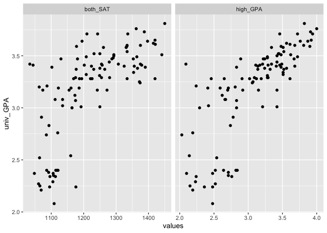
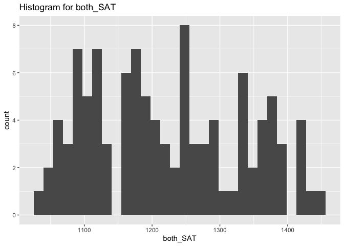
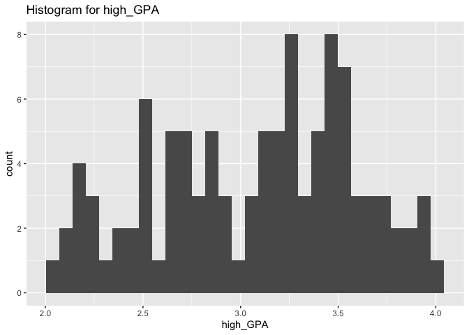
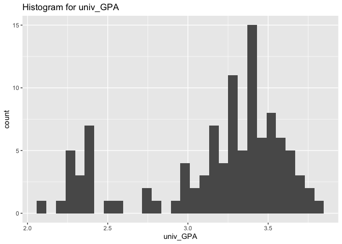

SAT and College Grades
================
Lily Jiang
2023-4-18

- [Grading Rubric](#grading-rubric)
  - [Individual](#individual)
  - [Due Date](#due-date)
- [Obtain the Data](#obtain-the-data)
  - [**q1** Visit the SAT and College GPA case study page, scroll to the
    bottom, and click the `Open Data with Excel` button. This will allow
    you to download an `xls` file. Save the file to your `data` folder,
    load the data as `df_sat`, and perform your “first checks” against
    these data. Answer the questions
    below:](#q1-visit-the-sat-and-college-gpa-case-study-page-scroll-to-the-bottom-and-click-the-open-data-with-excel-button-this-will-allow-you-to-download-an-xls-file-save-the-file-to-your-data-folder-load-the-data-as-df_sat-and-perform-your-first-checks-against-these-data-answer-the-questions-below)
- [Analysis with Hypothesis Testing](#analysis-with-hypothesis-testing)
  - [View 1: Correlations](#view-1-correlations)
    - [**q2** Create a *single* plot that shows `univ_GPA` against
      *both* `high_GPA` and `both_SAT`. Visually compare the two
      trends.](#q2-create-a-single-plot-that-shows-univ_gpa-against-both-high_gpa-and-both_sat-visually-compare-the-two-trends)
    - [Hypothesis Testing with a Correlation
      Coefficient](#hypothesis-testing-with-a-correlation-coefficient)
    - [**q3** Plot histograms for `both_SAT, high_GPA, univ_GPA`.
      Which—if any—of the variables look approximately normally
      distributed.](#q3-plot-histograms-for-both_sat-high_gpa-univ_gpa-whichif-anyof-the-variables-look-approximately-normally-distributed)
    - [**q4** Use the function `cor.test()` to construct confidence
      intervals for `corr[high_GPA, univ_GPA` and
      `corr[both_SAT, univ_GPA]`. Answer the questions
      below.](#q4-use-the-function-cortest-to-construct-confidence-intervals-for-corrhigh_gpa-univ_gpa-and-corrboth_sat-univ_gpa-answer-the-questions-below)
    - [**q5** Use the bootstrap to approximate a confidence interval for
      `corr[high_GPA, univ_GPA`. Compare your results—both the estimate
      and confidence interval—to your results from
      q4.](#q5-use-the-bootstrap-to-approximate-a-confidence-interval-for-corrhigh_gpa-univ_gpa-compare-your-resultsboth-the-estimate-and-confidence-intervalto-your-results-from-q4)
  - [View 2: Modeling](#view-2-modeling)
    - [Hypothesis Testing with a
      Model](#hypothesis-testing-with-a-model)
    - [**q6** Fit a linear model predicting `univ_GPA` with the
      predictor `both_SAT`. Assess the model to determine how effective
      a predictor `both_SAT` is for `univ_GPA`. Interpret the resulting
      confidence interval for the coefficient on
      `both_SAT`.](#q6-fit-a-linear-model-predicting-univ_gpa-with-the-predictor-both_sat-assess-the-model-to-determine-how-effective-a-predictor-both_sat-is-for-univ_gpa-interpret-the-resulting-confidence-interval-for-the-coefficient-on-both_sat)
    - [**q7** Fit a model predicting `univ_GPA` using both `high_GPA`
      and `both_SAT`. Compare the prediction accuracy and hypothesis
      test
      results.](#q7-fit-a-model-predicting-univ_gpa-using-both-high_gpa-and-both_sat-compare-the-prediction-accuracy-and-hypothesis-test-results)
  - [Synthesize](#synthesize)
    - [**q8** Using the results from all previous q’s, answer the
      following
      questions.](#q8-using-the-results-from-all-previous-qs-answer-the-following-questions)
- [End Notes](#end-notes)

*Purpose*: How do we apply hypothesis testing to investigating data? In
this challenge you’ll practice using hypothesis testing tools to make
sense of a dataset.

*Reading*: - [Harvard Study Says SATs Should Be Optional: Here’s
Why](https://www.csmonitor.com/USA/USA-Update/2016/0120/Harvard-study-says-SATs-should-be-optional.-Here-s-why)
(Optional); easy-to-read news article on colleges going SAT-free -
[Norm-Referenced Tests and Race-Blind
Admissions](https://cshe.berkeley.edu/publications/norm-referenced-tests-and-race-blind-admissions-case-eliminating-sat-and-act-university)
(Optional); technical report on relationship between the SAT/ACT and
non-academic factors

*Credit*: This is based on a [case
study](http://onlinestatbook.com/2/case_studies/sat.html) originally
prepared by Emily Zitek, with data collected through the research of
Thomas MacFarland.

``` r
library(tidyverse)
```

    ## ── Attaching packages ─────────────────────────────────────── tidyverse 1.3.2 ──
    ## ✔ ggplot2 3.4.0      ✔ purrr   1.0.1 
    ## ✔ tibble  3.1.8      ✔ dplyr   1.0.10
    ## ✔ tidyr   1.2.1      ✔ stringr 1.5.0 
    ## ✔ readr   2.1.3      ✔ forcats 0.5.2 
    ## ── Conflicts ────────────────────────────────────────── tidyverse_conflicts() ──
    ## ✖ dplyr::filter() masks stats::filter()
    ## ✖ dplyr::lag()    masks stats::lag()

``` r
library(readxl)
library(broom)
library(modelr)
```

    ## 
    ## Attaching package: 'modelr'
    ## 
    ## The following object is masked from 'package:broom':
    ## 
    ##     bootstrap

``` r
library(rsample)
```

<!-- include-rubric -->

# Grading Rubric

<!-- -------------------------------------------------- -->

Unlike exercises, **challenges will be graded**. The following rubrics
define how you will be graded, both on an individual and team basis.

## Individual

<!-- ------------------------- -->

| Category    | Needs Improvement                                                                                                | Satisfactory                                                                                                               |
|-------------|------------------------------------------------------------------------------------------------------------------|----------------------------------------------------------------------------------------------------------------------------|
| Effort      | Some task **q**’s left unattempted                                                                               | All task **q**’s attempted                                                                                                 |
| Observed    | Did not document observations, or observations incorrect                                                         | Documented correct observations based on analysis                                                                          |
| Supported   | Some observations not clearly supported by analysis                                                              | All observations clearly supported by analysis (table, graph, etc.)                                                        |
| Assessed    | Observations include claims not supported by the data, or reflect a level of certainty not warranted by the data | Observations are appropriately qualified by the quality & relevance of the data and (in)conclusiveness of the support      |
| Specified   | Uses the phrase “more data are necessary” without clarification                                                  | Any statement that “more data are necessary” specifies which *specific* data are needed to answer what *specific* question |
| Code Styled | Violations of the [style guide](https://style.tidyverse.org/) hinder readability                                 | Code sufficiently close to the [style guide](https://style.tidyverse.org/)                                                 |

## Due Date

<!-- ------------------------- -->

All the deliverables stated in the rubrics above are due **at midnight**
before the day of the class discussion of the challenge. See the
[Syllabus](https://docs.google.com/document/d/1qeP6DUS8Djq_A0HMllMqsSqX3a9dbcx1/edit?usp=sharing&ouid=110386251748498665069&rtpof=true&sd=true)
for more information.

*Background*: Every year about 2 million students take the Scholastic
Aptitude Test (SAT). The exam is
[controversial](http://www.nea.org/home/73288.htm) but [extremely
consequential](https://www.csmonitor.com/2004/0518/p13s01-legn.html).
There are many claims about the SAT, but we’re going to look at just
one: Is the SAT predictive of scholastic performance in college? It
turns out this is a fairly complicated question to assess—we’ll get an
introduction to some of the complexities.

# Obtain the Data

<!-- -------------------------------------------------- -->

### **q1** Visit the [SAT and College GPA](http://onlinestatbook.com/2/case_studies/sat.html) case study page, scroll to the bottom, and click the `Open Data with Excel` button. This will allow you to download an `xls` file. Save the file to your `data` folder, load the data as `df_sat`, and perform your “first checks” against these data. Answer the questions below:

``` r
df_sat <- read_excel("data/sat.xls")

glimpse(df_sat)
```

    ## Rows: 105
    ## Columns: 5
    ## $ high_GPA <dbl> 3.45, 2.78, 2.52, 3.67, 3.24, 2.10, 2.82, 2.36, 2.42, 3.51, 3…
    ## $ math_SAT <dbl> 643, 558, 583, 685, 592, 562, 573, 559, 552, 617, 684, 568, 6…
    ## $ verb_SAT <dbl> 589, 512, 503, 602, 538, 486, 548, 536, 583, 591, 649, 592, 5…
    ## $ comp_GPA <dbl> 3.76, 2.87, 2.54, 3.83, 3.29, 2.64, 2.86, 2.03, 2.81, 3.41, 3…
    ## $ univ_GPA <dbl> 3.52, 2.91, 2.40, 3.47, 3.47, 2.37, 2.40, 2.24, 3.02, 3.32, 3…

``` r
summary(df_sat)
```

    ##     high_GPA        math_SAT        verb_SAT        comp_GPA    
    ##  Min.   :2.030   Min.   :516.0   Min.   :480.0   Min.   :2.030  
    ##  1st Qu.:2.670   1st Qu.:573.0   1st Qu.:548.0   1st Qu.:2.870  
    ##  Median :3.170   Median :612.0   Median :591.0   Median :3.210  
    ##  Mean   :3.076   Mean   :623.1   Mean   :598.6   Mean   :3.128  
    ##  3rd Qu.:3.480   3rd Qu.:675.0   3rd Qu.:645.0   3rd Qu.:3.490  
    ##  Max.   :4.000   Max.   :718.0   Max.   :732.0   Max.   :4.000  
    ##     univ_GPA    
    ##  Min.   :2.080  
    ##  1st Qu.:3.010  
    ##  Median :3.290  
    ##  Mean   :3.173  
    ##  3rd Qu.:3.470  
    ##  Max.   :3.810

**Observations**:

- Fill in the following “data dictionary”

| Column     | Meaning                |
|------------|------------------------|
| `high_GPA` | High school GPA        |
| `math_SAT` | Math SAT score         |
| `verb_SAT` | Verbal SAT score       |
| `comp_GPA` | Computer science GPA   |
| `univ_GPA` | Overall university GPA |

- What information do we have about these students?
  - We have their SAT scores and GPA information. Additionally, we know
    all these students graduated with an undergrad degree in CS from a
    state university.
- What kinds of information *do we not have* about these students?
  - Notably, we don’t have any qualitative information about these
    students that might provide additional contexts. Many things have an
    affect on SAT scores and GPA, such as the amount of test-taking
    resources available and the competitive culture of the student body.
  - We also don’t have information about the GPA system at these
    students’ high schools. It isn’t specified that they all went to the
    same HS, so it isn’t guaranteed that the GPA scale is exactly the
    same or that the deflation/inflation is the same across all data
    points.
- Based on these missing variables, what possible effects could be
  present in the data that we would have *no way of detecting*?
  - The grade inflation/deflation aspect could have a massive
    undetectable impact on the data. First off, we don’t know the
    specific amount of inflation/deflation, so we wouldn’t be able to
    normalize the data at all. Additionally, we don’t even have a way of
    knowing which GPAs are scaled up/down relative to others, so the
    skews blend into the inherent variation of the data.

# Analysis with Hypothesis Testing

<!-- ----------------------------------------------------------------------- -->

We’re going to use two complementary approaches to analyze the data, the
first based on hypothesis testing of correlation coefficients, and the
second based on fitting a regression model and interpreting the
regression coefficients.

To simplify the analysis, let’s look at a composite SAT score:

``` r
## NOTE: No need to edit this
df_composite <-
  df_sat %>%
  mutate(both_SAT = math_SAT + verb_SAT)
```

## View 1: Correlations

<!-- ----------------------------------------------------------------------- -->

### **q2** Create a *single* plot that shows `univ_GPA` against *both* `high_GPA` and `both_SAT`. Visually compare the two trends.

*Hint*: One way to do this is to first *pivot* `df_composite`.

``` r
df_composite %>%
  pivot_longer(
    cols = c(high_GPA, both_SAT),
    names_to = "GPA_and_SAT",
    values_to = "values"
  ) %>%
  ggplot(aes(x = univ_GPA, y = values)) +
  geom_point() +
  facet_wrap(~GPA_and_SAT, scales = "free_y")
```

<!-- -->

**Observations**:

- What relationship do `univ_GPA` and `both_SAT` exhibit?
  - A very prominent, positive, somewhat-linear (but also
    somewhat-exponential looking) correlation.
- What relationship do `univ_GPA` and `high_GPA` exhibit?
  - A very prominent positive linear correlation. The cloud of points
    appears to converge onto the line as the GPA is higher.

### Hypothesis Testing with a Correlation Coefficient

<!-- ------------------------- -->

We can use the idea of hypothesis testing with a correlation
coefficient. The idea is to set our null hypothesis to the case where
there is no correlation, and test to see if the data contradict that
perspective. Formally, the null (H0) and alternative (HA) hypotheses
relating to a correlation coefficient between two variables `X, Y` are:

$$\text{H0: } \text{Corr}[X, Y] = 0$$

$$\text{HA: } \text{Corr}[X, Y] \neq 0$$

The R function `cor.test` implements such a hypothesis test under the
assumption that `X, Y` are both normally distributed. First, let’s check
to see if this assumption looks reasonable for our data.

### **q3** Plot histograms for `both_SAT, high_GPA, univ_GPA`. Which—if any—of the variables look approximately normally distributed.

``` r
df_composite %>%
  ggplot() +
  geom_histogram(aes(x = both_SAT), bins = 30) +
  ggtitle("Histogram for both_SAT")
```

<!-- -->

``` r
df_composite %>%
  ggplot() +
  geom_histogram(aes(x = high_GPA), bins = 30) +
  ggtitle("Histogram for high_GPA")
```

<!-- -->

``` r
df_composite %>%
  ggplot() +
  geom_histogram(aes(x = univ_GPA), bins = 30) +
  ggtitle("Histogram for univ_GPA")
```

<!-- -->

**Observations**:

- To what extent does `both_SAT` look like a normal distribution?
  - It doesn’t really resemble a normal distribution. There does appear
    to be a peak at the midpoint of the x axis, but the rest of the
    shape isn’t very conducive to a normal distribution. It almost
    appears that there is a bimodal distribution, with a random peak in
    the valley between the two bimodal peaks.
- To what extent does `high_GPA` look like a normal distribution?
  - This also looks bimodal. It appears to me that the two peaks kind of
    fall at 2.5 and 3.5.
- To what extent does `univ_GPA` look like a normal distribution?
  - This appears to have the bell-shaped curve that you’d expect with a
    normal distribution (with a peak at ~3.4), but the appearance of
    being a normal distribution is ruined by the values in the 2-2.5
    range. Once again, this looks bimodal, with the other peak at a GPA
    of ~2.4. This plot is very clearly skewed left, which is different
    from the previous 2 plots we saw.

Keep in mind your findings as you complete q4.

### **q4** Use the function `cor.test()` to construct confidence intervals for `corr[high_GPA, univ_GPA` and `corr[both_SAT, univ_GPA]`. Answer the questions below.

``` r
cor.test(df_composite$high_GPA, df_composite$univ_GPA, method = "pearson")
```

    ## 
    ##  Pearson's product-moment correlation
    ## 
    ## data:  df_composite$high_GPA and df_composite$univ_GPA
    ## t = 12.632, df = 103, p-value < 2.2e-16
    ## alternative hypothesis: true correlation is not equal to 0
    ## 95 percent confidence interval:
    ##  0.6911690 0.8449761
    ## sample estimates:
    ##       cor 
    ## 0.7795631

``` r
cor.test(df_composite$both_SAT, df_composite$univ_GPA, method = "pearson")
```

    ## 
    ##  Pearson's product-moment correlation
    ## 
    ## data:  df_composite$both_SAT and df_composite$univ_GPA
    ## t = 9.5339, df = 103, p-value = 8.052e-16
    ## alternative hypothesis: true correlation is not equal to 0
    ## 95 percent confidence interval:
    ##  0.5674824 0.7746821
    ## sample estimates:
    ##       cor 
    ## 0.6846776

**Observations**:

- Which correlations are significantly nonzero?
  - Both are significantly nonzero. Zero is well outside the range of
    the two confidence intervals.
- Which of `high_GPA` and `both_SAT` seems to be more strongly
  correlated with `univ_GPA`?
  - `high_GPA` is more strongly correlated, because the correlation of
    0.7795631 is higher than `both_SAT`’s correlation of 0.6846776.
- How do the results here compare with the visual you created in q2?
  - It lines up pretty well. With the visual, I could see a clear
    positive trend, but it wasn’t a very clean trend. This matches with
    the positive, somewhat-high values correlation values of 0.7795631
    and 0.6846776. Additionally, the two correlations looked quite
    similar, but the `both_SAT` appeared to have more of a spread in
    values than the `high_GPA` did. This aligns with the calculated
    results here, as the `both_SAT` correlation coefficient is lower
    than the `high_GPA` value.
- Based on these results, what can we say about the predictive
  capabilities of both `high_GPA` and `both_SAT` to predict `univ_GPA`?
  - Both are relatively decent predictors, but `high_GPA` is noticeably
    better at predicting `univ_GPA` as the correlation is stronger
    (larger correlation coefficient).

Finally, let’s use the bootstrap to perform the same test using
*different* assumptions.

### **q5** Use the bootstrap to approximate a confidence interval for `corr[high_GPA, univ_GPA`. Compare your results—both the estimate and confidence interval—to your results from q4.

``` r
set.seed(1)
df_bootstrap <-
  df_composite %>%
  bootstraps(times = 1000) %>%
  mutate(df = map(splits, ~ analysis(.x))) %>%
  slice(1:10) %>%
  unnest(df)

cor.test(df_bootstrap$high_GPA, df_bootstrap$univ_GPA, method = "pearson")
```

    ## 
    ##  Pearson's product-moment correlation
    ## 
    ## data:  df_bootstrap$high_GPA and df_bootstrap$univ_GPA
    ## t = 39.902, df = 1048, p-value < 2.2e-16
    ## alternative hypothesis: true correlation is not equal to 0
    ## 95 percent confidence interval:
    ##  0.7513667 0.7995023
    ## sample estimates:
    ##       cor 
    ## 0.7765652

**Observations**:

- How does your estimate from q5 compare with your estimate from q4?
  - The sample estimates between the two methods are quite similar
    (0.7795631 for just the original sample vs 0.7765652 for
    bootstrapping).
- How does your CI from q5 compare with your CI from q4?
  - q4 generated a confidence interval of (0.6911690, 0.8449761),
    whereas this estimate generated a confidence interval of (0.7513667,
    0.7995023). This estimate has a much smaller confidence interval
    than performing the `cor.test()` on just the original sample.

*Aside*: When you use two different approximations to compute the same
quantity and get similar results, that’s an *encouraging sign*. Such an
outcome lends a bit more credibility to the results.

## View 2: Modeling

<!-- ------------------------- -->

Correlations are useful for relating two variables at a time. To study
the relationship among more variables we can instead use a fitted model.
Using a model, we can also help assess whether it is *worthwhile* to
measure a variable.

To begin, let’s first split the data into training and validation sets.

``` r
## NOTE: No need to edit
set.seed(101)

df_train <-
  df_composite %>%
  rowid_to_column() %>%
  slice_sample(n = 80)

df_validate <-
  df_composite %>%
  rowid_to_column() %>%
  anti_join(
    .,
    df_train,
    by = "rowid"
  )
```

### Hypothesis Testing with a Model

<!-- ------------------------- -->

We can combine the ideas of hypothesis testing with a model. Using a
model, we can express our hypotheses in terms of the model parameters.
For instance, if we were interested in whether $X$ has an affect on $Y$,
we might set up a model:

$$Y_i = \beta X_i + \epsilon_i$$

With the hypotheses:

$$\text{H0}: \beta = 0$$

$$\text{HA}: \beta \neq 0$$

In this case, we’re testing for whether $X$ has a significant effect on
$Y$. Let’s apply this idea to relating the variables `univ_GPA` and
`high_GPA`. Luckily R has built-in tools to construct a confidence
interval on the $\beta$’s in a regression \[1\]; we’ll simply use those
tools rather than do it by hand.

### **q6** Fit a linear model predicting `univ_GPA` with the predictor `both_SAT`. Assess the model to determine how effective a predictor `both_SAT` is for `univ_GPA`. Interpret the resulting confidence interval for the coefficient on `both_SAT`.

``` r
fit_basic <-
  lm(df_train$univ_GPA ~ df_train$both_SAT)

summary(fit_basic)
```

    ## 
    ## Call:
    ## lm(formula = df_train$univ_GPA ~ df_train$both_SAT)
    ## 
    ## Residuals:
    ##      Min       1Q   Median       3Q      Max 
    ## -0.80287 -0.17661  0.02994  0.19661  0.74141 
    ## 
    ## Coefficients:
    ##                    Estimate Std. Error t value Pr(>|t|)    
    ## (Intercept)       0.0259841  0.3964049   0.066    0.948    
    ## df_train$both_SAT 0.0025654  0.0003219   7.969 1.08e-11 ***
    ## ---
    ## Signif. codes:  0 '***' 0.001 '**' 0.01 '*' 0.05 '.' 0.1 ' ' 1
    ## 
    ## Residual standard error: 0.336 on 78 degrees of freedom
    ## Multiple R-squared:  0.4488, Adjusted R-squared:  0.4417 
    ## F-statistic:  63.5 on 1 and 78 DF,  p-value: 1.082e-11

``` r
## NOTE: The following computes confidence intervals on regression coefficients
fit_basic %>%
  tidy(
    conf.int = TRUE,
    conf.level = 0.99
  )
```

    ## # A tibble: 2 × 7
    ##   term              estimate std.error statistic  p.value conf.low conf.high
    ##   <chr>                <dbl>     <dbl>     <dbl>    <dbl>    <dbl>     <dbl>
    ## 1 (Intercept)        0.0260   0.396       0.0655 9.48e- 1 -1.02      1.07   
    ## 2 df_train$both_SAT  0.00257  0.000322    7.97   1.08e-11  0.00172   0.00342

**Observations**:

- What is the confidence interval on the coefficient of `both_SAT`? Is
  this coefficient significantly different from zero?
  - The interval is (0.001715376, 0.003415381). This is significantly
    different from 0 because the interval doesn’t include 0 within it.
- By itself, how well does `both_SAT` predict `univ_GPA`?
  - Somewhat well; this linear model fitting created an adjusted R^2
    value of 0.4417, which is certainly more than 0 (indicating there is
    *some* indicative correlation). But because 0.4417 is also quite far
    from a perfect 1, `both_SAT` is not a very accurate predictor of
    `univ_GPA`.

Remember from `e-model03-interp-warnings` that there are challenges with
interpreting regression coefficients! Let’s investigate that idea
further.

### **q7** Fit a model predicting `univ_GPA` using both `high_GPA` and `both_SAT`. Compare the prediction accuracy and hypothesis test results.

``` r
# model with just high_GPA

fit_basic <-
  lm(df_train$univ_GPA ~ df_train$high_GPA)

summary(fit_basic)
```

    ## 
    ## Call:
    ## lm(formula = df_train$univ_GPA ~ df_train$high_GPA)
    ## 
    ## Residuals:
    ##      Min       1Q   Median       3Q      Max 
    ## -0.68906 -0.12069  0.01431  0.18179  0.91092 
    ## 
    ## Coefficients:
    ##                   Estimate Std. Error t value Pr(>|t|)    
    ## (Intercept)        1.11582    0.19299   5.782 1.45e-07 ***
    ## df_train$high_GPA  0.66663    0.06174  10.797  < 2e-16 ***
    ## ---
    ## Signif. codes:  0 '***' 0.001 '**' 0.01 '*' 0.05 '.' 0.1 ' ' 1
    ## 
    ## Residual standard error: 0.2866 on 78 degrees of freedom
    ## Multiple R-squared:  0.5991, Adjusted R-squared:  0.594 
    ## F-statistic: 116.6 on 1 and 78 DF,  p-value: < 2.2e-16

``` r
## NOTE: The following computes confidence intervals on regression coefficients
fit_basic %>%
  tidy(
    conf.int = TRUE,
    conf.level = 0.99
  )
```

    ## # A tibble: 2 × 7
    ##   term              estimate std.error statistic  p.value conf.low conf.high
    ##   <chr>                <dbl>     <dbl>     <dbl>    <dbl>    <dbl>     <dbl>
    ## 1 (Intercept)          1.12     0.193       5.78 1.45e- 7    0.606     1.63 
    ## 2 df_train$high_GPA    0.667    0.0617     10.8  3.79e-17    0.504     0.830

``` r
# model with both_SAT + high_GPA
fit_basic <-
  lm(df_train$univ_GPA ~ (df_train$both_SAT+df_train$high_GPA))

summary(fit_basic)
```

    ## 
    ## Call:
    ## lm(formula = df_train$univ_GPA ~ (df_train$both_SAT + df_train$high_GPA))
    ## 
    ## Residuals:
    ##      Min       1Q   Median       3Q      Max 
    ## -0.68463 -0.13922  0.00468  0.16222  0.91790 
    ## 
    ## Coefficients:
    ##                    Estimate Std. Error t value Pr(>|t|)    
    ## (Intercept)       0.7577417  0.3621513   2.092   0.0397 *  
    ## df_train$both_SAT 0.0005339  0.0004574   1.167   0.2466    
    ## df_train$high_GPA 0.5704601  0.1028619   5.546 3.96e-07 ***
    ## ---
    ## Signif. codes:  0 '***' 0.001 '**' 0.01 '*' 0.05 '.' 0.1 ' ' 1
    ## 
    ## Residual standard error: 0.2859 on 77 degrees of freedom
    ## Multiple R-squared:  0.6061, Adjusted R-squared:  0.5959 
    ## F-statistic: 59.24 on 2 and 77 DF,  p-value: 2.643e-16

``` r
## NOTE: The following computes confidence intervals on regression coefficients
fit_basic %>%
  tidy(
    conf.int = TRUE,
    conf.level = 0.99
  )
```

    ## # A tibble: 3 × 7
    ##   term              estimate std.error statistic     p.value  conf.low conf.high
    ##   <chr>                <dbl>     <dbl>     <dbl>       <dbl>     <dbl>     <dbl>
    ## 1 (Intercept)       0.758     0.362         2.09 0.0397      -0.199      1.71   
    ## 2 df_train$both_SAT 0.000534  0.000457      1.17 0.247       -0.000674   0.00174
    ## 3 df_train$high_GPA 0.570     0.103         5.55 0.000000396  0.299      0.842

**Observations**:

- How well do these models perform, compared to the one you built in q6?
  - Both models outperform the model in q6, as noted with the higher R^2
    values.
  - The model with just `high_GPA` has an adjusted R^2 value of 0.594.
    The model with both variables has an adjusted R^2 value of 0.5959.
    Comparing these numbers with the 0.4417 from before, both of these
    models have a much higher correlation than the model in q6.
- What is the confidence interval on the coefficient of `both_SAT` when
  including `high_GPA` as a predictor? Is this coefficient significantly
  different from zero?
  - The confidence interval is (-0.0006740696, 0.001741962). This is not
    significantly different from 0, as 0 actually falls within this
    interval.
- How do the hypothesis test results compare with the results in q6?
  - Both are better than the results of q6.

## Synthesize

<!-- ------------------------- -->

Before closing, let’s synthesize a bit from the analyses above.

### **q8** Using the results from all previous q’s, answer the following questions.

**Observations**:

- Between `both_SAT` and `high_GPA`, which single variable would you
  choose to predict `univ_GPA`? Why?
  - `high_GPA` is better for predicting `univ_GPA`, because it is more
    strongly correlated.
- Is `both_SAT` an effective predictor of `univ_GPA`? What specific
  pieces of evidence do you have in favor of `both_SAT` being effective?
  What specific pieces of evidence do you have against?
  - I would say that it isn’t an effective predictor, but this is also
    because I know that `high_GPA` is a pretty strong predictor.
    Overall, `both_SAT` does have a positive correlation with `univ_GPA`
    so it *could* be argued that it can be used to predict `univ_GPA`.
    But on the other hand, the correlation is quite weak, especially
    comparing it to the effectiveness of our other predictor.

# End Notes

<!-- ----------------------------------------------------------------------- -->

\[1\] There are also assumptions underlying this kind of testing, for
more information see this [Wiki
article](https://en.wikipedia.org/wiki/Linear_regression#Assumptions).
