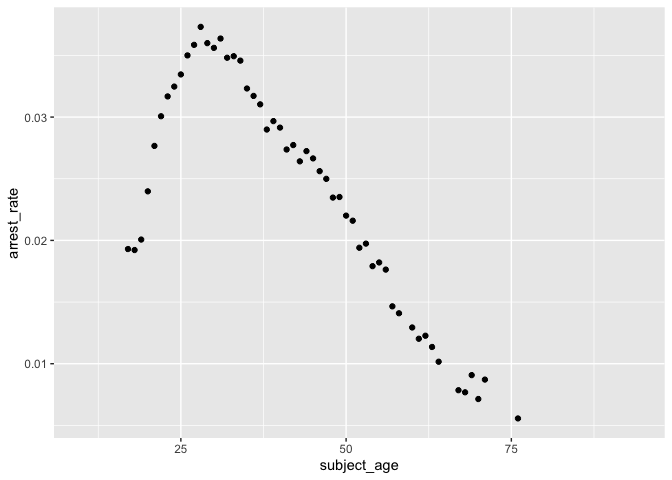
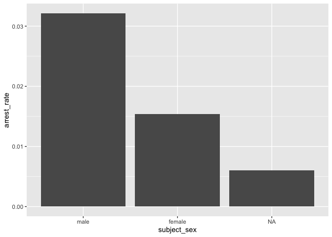
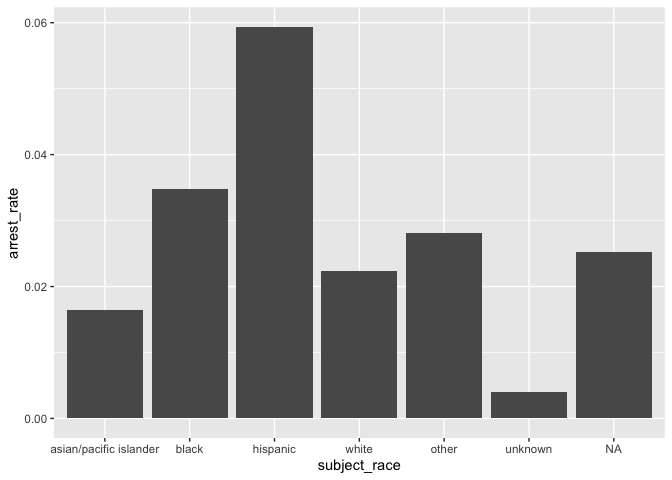

Massachusetts Highway Stops
================
Lily Jiang
2023-05-01

- [Grading Rubric](#grading-rubric)
  - [Individual](#individual)
  - [Due Date](#due-date)
- [Setup](#setup)
  - [**q1** Go to the Stanford Open Policing Project page and download
    the Massachusetts State Police records in `Rds` format. Move the
    data to your `data` folder and match the `filename` to load the
    data.](#q1-go-to-the-stanford-open-policing-project-page-and-download-the-massachusetts-state-police-records-in-rds-format-move-the-data-to-your-data-folder-and-match-the-filename-to-load-the-data)
- [EDA](#eda)
  - [**q2** Do your “first checks” on the dataset. What are the basic
    facts about this
    dataset?](#q2-do-your-first-checks-on-the-dataset-what-are-the-basic-facts-about-this-dataset)
  - [**q3** Check the set of factor levels for `subject_race` and
    `raw_Race`. What do you note about overlap / difference between the
    two
    sets?](#q3-check-the-set-of-factor-levels-for-subject_race-and-raw_race-what-do-you-note-about-overlap--difference-between-the-two-sets)
  - [**q4** Check whether `subject_race` and `raw_Race` match for a
    large fraction of cases. Which of the two hypotheses above is most
    likely, based on your
    results?](#q4-check-whether-subject_race-and-raw_race-match-for-a-large-fraction-of-cases-which-of-the-two-hypotheses-above-is-most-likely-based-on-your-results)
  - [Vis](#vis)
    - [**q5** Compare the *arrest rate*—the fraction of total cases in
      which the subject was arrested—across different factors. Create as
      many visuals (or tables) as you need, but make sure to check the
      trends across all of the `subject` variables. Answer the questions
      under *observations*
      below.](#q5-compare-the-arrest-ratethe-fraction-of-total-cases-in-which-the-subject-was-arrestedacross-different-factors-create-as-many-visuals-or-tables-as-you-need-but-make-sure-to-check-the-trends-across-all-of-the-subject-variables-answer-the-questions-under-observations-below)
- [Modeling](#modeling)
  - [**q6** Run the following code and interpret the regression
    coefficients. Answer the the questions under *observations*
    below.](#q6-run-the-following-code-and-interpret-the-regression-coefficients-answer-the-the-questions-under-observations-below)
  - [**q7** Re-fit the logistic regression from q6 setting `"white"` as
    the reference level for `subject_race`. Interpret the the model
    terms and answer the questions
    below.](#q7-re-fit-the-logistic-regression-from-q6-setting-white-as-the-reference-level-for-subject_race-interpret-the-the-model-terms-and-answer-the-questions-below)
  - [**q8** Re-fit the model using a factor indicating the presence of
    contraband in the subject’s vehicle. Answer the questions under
    *observations*
    below.](#q8-re-fit-the-model-using-a-factor-indicating-the-presence-of-contraband-in-the-subjects-vehicle-answer-the-questions-under-observations-below)
  - [**q9** Go deeper: Pose at least one more question about the data
    and fit at least one more model in support of answering that
    question.](#q9-go-deeper-pose-at-least-one-more-question-about-the-data-and-fit-at-least-one-more-model-in-support-of-answering-that-question)
  - [Further Reading](#further-reading)

*Purpose*: In this last challenge we’ll focus on using logistic
regression to study a large, complicated dataset. Interpreting the
results of a model can be challenging—both in terms of the statistics
and the real-world reasoning—so we’ll get some practice in this
challenge.

<!-- include-rubric -->

# Grading Rubric

<!-- -------------------------------------------------- -->

Unlike exercises, **challenges will be graded**. The following rubrics
define how you will be graded, both on an individual and team basis.

## Individual

<!-- ------------------------- -->

| Category    | Needs Improvement                                                                                                | Satisfactory                                                                                                               |
|-------------|------------------------------------------------------------------------------------------------------------------|----------------------------------------------------------------------------------------------------------------------------|
| Effort      | Some task **q**’s left unattempted                                                                               | All task **q**’s attempted                                                                                                 |
| Observed    | Did not document observations, or observations incorrect                                                         | Documented correct observations based on analysis                                                                          |
| Supported   | Some observations not clearly supported by analysis                                                              | All observations clearly supported by analysis (table, graph, etc.)                                                        |
| Assessed    | Observations include claims not supported by the data, or reflect a level of certainty not warranted by the data | Observations are appropriately qualified by the quality & relevance of the data and (in)conclusiveness of the support      |
| Specified   | Uses the phrase “more data are necessary” without clarification                                                  | Any statement that “more data are necessary” specifies which *specific* data are needed to answer what *specific* question |
| Code Styled | Violations of the [style guide](https://style.tidyverse.org/) hinder readability                                 | Code sufficiently close to the [style guide](https://style.tidyverse.org/)                                                 |

## Due Date

<!-- ------------------------- -->

All the deliverables stated in the rubrics above are due **at midnight**
before the day of the class discussion of the challenge. See the
[Syllabus](https://docs.google.com/document/d/1qeP6DUS8Djq_A0HMllMqsSqX3a9dbcx1/edit?usp=sharing&ouid=110386251748498665069&rtpof=true&sd=true)
for more information.

*Background*: We’ll study data from the [Stanford Open Policing
Project](https://openpolicing.stanford.edu/data/), specifically their
dataset on Massachusetts State Patrol police stops.

``` r
library(tidyverse)
```

    ## ── Attaching core tidyverse packages ──────────────────────── tidyverse 2.0.0 ──
    ## ✔ dplyr     1.1.2     ✔ readr     2.1.4
    ## ✔ forcats   1.0.0     ✔ stringr   1.5.0
    ## ✔ ggplot2   3.4.2     ✔ tibble    3.2.1
    ## ✔ lubridate 1.9.2     ✔ tidyr     1.3.0
    ## ✔ purrr     1.0.1     
    ## ── Conflicts ────────────────────────────────────────── tidyverse_conflicts() ──
    ## ✖ dplyr::filter() masks stats::filter()
    ## ✖ dplyr::lag()    masks stats::lag()
    ## ℹ Use the conflicted package (<http://conflicted.r-lib.org/>) to force all conflicts to become errors

``` r
library(broom)
```

# Setup

<!-- -------------------------------------------------- -->

### **q1** Go to the [Stanford Open Policing Project](https://openpolicing.stanford.edu/data/) page and download the Massachusetts State Police records in `Rds` format. Move the data to your `data` folder and match the `filename` to load the data.

*Note*: An `Rds` file is an R-specific file format. The function
`readRDS` will read these files.

``` r
filename <- "data/yg821jf8611_ma_statewide_2020_04_01.rds"
df_data <- readRDS(filename)
```

# EDA

<!-- -------------------------------------------------- -->

### **q2** Do your “first checks” on the dataset. What are the basic facts about this dataset?

``` r
glimpse(df_data)
```

    ## Rows: 3,416,238
    ## Columns: 24
    ## $ raw_row_number             <chr> "1", "2", "3", "4", "5", "6", "7", "8", "9"…
    ## $ date                       <date> 2007-06-06, 2007-06-07, 2007-06-07, 2007-0…
    ## $ location                   <chr> "MIDDLEBOROUGH", "SEEKONK", "MEDFORD", "MED…
    ## $ county_name                <chr> "Plymouth County", "Bristol County", "Middl…
    ## $ subject_age                <int> 33, 36, 56, 37, 22, 34, 54, 31, 21, 56, 56,…
    ## $ subject_race               <fct> white, white, white, white, hispanic, white…
    ## $ subject_sex                <fct> male, male, female, male, female, male, mal…
    ## $ type                       <fct> vehicular, vehicular, vehicular, vehicular,…
    ## $ arrest_made                <lgl> FALSE, FALSE, FALSE, FALSE, FALSE, FALSE, F…
    ## $ citation_issued            <lgl> TRUE, FALSE, FALSE, FALSE, TRUE, TRUE, TRUE…
    ## $ warning_issued             <lgl> FALSE, TRUE, TRUE, TRUE, FALSE, FALSE, FALS…
    ## $ outcome                    <fct> citation, warning, warning, warning, citati…
    ## $ contraband_found           <lgl> NA, FALSE, NA, NA, NA, NA, NA, NA, NA, NA, …
    ## $ contraband_drugs           <lgl> NA, FALSE, NA, NA, NA, NA, NA, NA, NA, NA, …
    ## $ contraband_weapons         <lgl> NA, FALSE, NA, NA, NA, NA, NA, NA, NA, NA, …
    ## $ contraband_alcohol         <lgl> FALSE, FALSE, FALSE, FALSE, FALSE, FALSE, F…
    ## $ contraband_other           <lgl> NA, FALSE, NA, NA, NA, NA, NA, NA, NA, NA, …
    ## $ frisk_performed            <lgl> NA, FALSE, NA, NA, NA, NA, NA, NA, NA, NA, …
    ## $ search_conducted           <lgl> FALSE, TRUE, FALSE, FALSE, FALSE, FALSE, FA…
    ## $ search_basis               <fct> NA, other, NA, NA, NA, NA, NA, NA, NA, NA, …
    ## $ reason_for_stop            <chr> "Speed", NA, NA, NA, NA, "Speed", NA, NA, N…
    ## $ vehicle_type               <chr> "Passenger", "Commercial", "Passenger", "Co…
    ## $ vehicle_registration_state <fct> MA, MA, MA, MA, MA, MA, MA, MA, MA, MA, MA,…
    ## $ raw_Race                   <chr> "White", "White", "White", "White", "Hispan…

Note that we have both a `subject_race` and `race_Raw` column. There are
a few possibilities as to what `race_Raw` represents:

- `race_Raw` could be the race of the police officer in the stop
- `race_Raw` could be an unprocessed version of `subject_race`

Let’s try to distinguish between these two possibilities.

### **q3** Check the set of factor levels for `subject_race` and `raw_Race`. What do you note about overlap / difference between the two sets?

``` r
# subject_race
df_data %>%
  pull(subject_race) %>%
  unique()
```

    ## [1] white                  hispanic               black                 
    ## [4] asian/pacific islander other                  <NA>                  
    ## [7] unknown               
    ## Levels: asian/pacific islander black hispanic white other unknown

``` r
# raw_Race
df_data %>%
  pull(raw_Race) %>%
  unique()
```

    ## [1] "White"                                        
    ## [2] "Hispanic"                                     
    ## [3] "Black"                                        
    ## [4] "Asian or Pacific Islander"                    
    ## [5] "Middle Eastern or East Indian (South Asian)"  
    ## [6] "American Indian or Alaskan Native"            
    ## [7] NA                                             
    ## [8] "None - for no operator present citations only"
    ## [9] "A"

**Observations**:

- What are the unique values for `subject_race`?
  - white, hispanic, black, asian/pacific islander, other, \<NA\>,
    unknown
- What are the unique values for `raw_Race`?
  - “White”, “Hispanic”, “Black”, “Asian or Pacific Islander”, “Middle
    Eastern or East Indian (South Asian)”, “American Indian or Alaskan
    Native”, NA, “None - for no operator present citations only”, “A”
- What is the overlap between the two sets?
  - If we ignore the formatting and look at the content, the overlap is:
    white, hispanic, black, asian/pacific islander, NA
- What is the difference between the two sets?
  - If we ignore the differences in formatting and look at the content,
    the differences are:

  - For `subject_race`: other, unknown

  - For `raw_Race`: “Middle Eastern or East Indian (South Asian)”,
    “American Indian or Alaskan Native”, “None - for no operator present
    citations only”, “A”

### **q4** Check whether `subject_race` and `raw_Race` match for a large fraction of cases. Which of the two hypotheses above is most likely, based on your results?

*Note*: Just to be clear, I’m *not* asking you to do a *statistical*
hypothesis test.

``` r
original_size <-
  df_data %>%
  nrow()

num_matching <- df_data %>%
  filter(
    (is.na(subject_race) & is.na(raw_Race)) |
    (subject_race == "white" & raw_Race == "White") |
    (subject_race == "hispanic" & raw_Race == "Hispanic") |
    (subject_race == "black" & raw_Race == "Black") |
    (subject_race == "asian/pacific islander" & raw_Race == "Asian or Pacific Islander")
  ) %>%
  nrow()

num_matching / original_size
```

    ## [1] 0.9729015

**Observations**

Between the two hypotheses:

- `race_Raw` could be the race of the police officer in the stop
- `race_Raw` could be an unprocessed version of `subject_race`

which is most plausible, based on your results?

- I think the second is more plausible, because about 97% of the
  `race_Raw` values match the `subject_race` value, which is quite a
  high value. This high of a value doesn’t seem realistic if we consider
  `race_Raw` as the race of the police officer in the stop.

## Vis

<!-- ------------------------- -->

### **q5** Compare the *arrest rate*—the fraction of total cases in which the subject was arrested—across different factors. Create as many visuals (or tables) as you need, but make sure to check the trends across all of the `subject` variables. Answer the questions under *observations* below.

(Note: Create as many chunks and visuals as you need)

``` r
# by subject_age
arrests_by_age <-
  df_data %>%
  group_by(subject_age, arrest_made) %>%
  summarise(
    totals = n()
  ) %>%
  pivot_wider(
    names_from = arrest_made,
    values_from = totals
  ) %>%
  mutate(
    total_encounters = sum(`FALSE`, `TRUE`, `NA`),
    arrest_rate = `TRUE`/`total_encounters`
  ) %>%
  rename(
    "num_arrested" = `TRUE`
  ) %>%
  select(
    c(subject_age, num_arrested, total_encounters, arrest_rate)
  )
```

    ## `summarise()` has grouped output by 'subject_age'. You can override using the
    ## `.groups` argument.

``` r
arrests_by_age
```

    ## # A tibble: 86 × 4
    ## # Groups:   subject_age [86]
    ##    subject_age num_arrested total_encounters arrest_rate
    ##          <int>        <int>            <int>       <dbl>
    ##  1          10            1               NA     NA     
    ##  2          11            1               NA     NA     
    ##  3          12            3               NA     NA     
    ##  4          13            6               NA     NA     
    ##  5          14           15               NA     NA     
    ##  6          15           44               NA     NA     
    ##  7          16          105               NA     NA     
    ##  8          17          338            17513      0.0193
    ##  9          18          940            48909      0.0192
    ## 10          19         1667            83065      0.0201
    ## # ℹ 76 more rows

``` r
arrests_by_age %>%
  ggplot(aes(x = subject_age, y = arrest_rate)) +
  geom_point()
```

    ## Warning: Removed 33 rows containing missing values (`geom_point()`).

<!-- -->

``` r
# by subject_sex
arrests_by_sex <-
  df_data %>%
  group_by(subject_sex, arrest_made) %>%
  summarise(
    totals = n()
  ) %>%
  pivot_wider(
    names_from = arrest_made,
    values_from = totals
  ) %>%
  mutate(
    total_encounters = sum(`FALSE`, `TRUE`, `NA`),
    arrest_rate = `TRUE`/`total_encounters`
  ) %>%
  rename(
    "num_arrested" = `TRUE`
  ) %>%
  select(
    c(subject_sex, num_arrested, total_encounters, arrest_rate)
  )
```

    ## `summarise()` has grouped output by 'subject_sex'. You can override using the
    ## `.groups` argument.

``` r
arrests_by_sex
```

    ## # A tibble: 3 × 4
    ## # Groups:   subject_sex [3]
    ##   subject_sex num_arrested total_encounters arrest_rate
    ##   <fct>              <int>            <int>       <dbl>
    ## 1 male               75920          2362238     0.0321 
    ## 2 female             16005          1038377     0.0154 
    ## 3 <NA>                  94            15623     0.00602

``` r
arrests_by_sex %>%
  ggplot(aes(x = subject_sex, y = arrest_rate)) +
  geom_col()
```

<!-- -->

``` r
# by subject_race
arrests_by_race <-
  df_data %>%
  group_by(subject_race, arrest_made) %>%
  summarise(
    totals = n()
  ) %>%
  pivot_wider(
    names_from = arrest_made,
    values_from = totals
  ) %>%
  mutate(
    total_encounters = sum(`FALSE`, `TRUE`, `NA`),
    arrest_rate = `TRUE`/`total_encounters`
  ) %>%
  rename(
    "num_arrested" = `TRUE`
  ) %>%
  select(
    c(subject_race, num_arrested, total_encounters, arrest_rate)
  )
```

    ## `summarise()` has grouped output by 'subject_race'. You can override using the
    ## `.groups` argument.

``` r
arrests_by_race
```

    ## # A tibble: 7 × 4
    ## # Groups:   subject_race [7]
    ##   subject_race           num_arrested total_encounters arrest_rate
    ##   <fct>                         <int>            <int>       <dbl>
    ## 1 asian/pacific islander         2748           166842     0.0165 
    ## 2 black                         12225           351610     0.0348 
    ## 3 hispanic                      20085           338317     0.0594 
    ## 4 white                         56540          2529780     0.0223 
    ## 5 other                           310            11008     0.0282 
    ## 6 unknown                          69            17017     0.00405
    ## 7 <NA>                             42             1664     0.0252

``` r
arrests_by_race %>%
  ggplot(aes(x = subject_race, y = arrest_rate)) +
  geom_col()
```

<!-- -->

**Observations**:

- How does `arrest_rate` tend to vary with `subject_age`?
  - The arrest rate peaks at around 28 years old. The older or younger
    the subject from 28 years old, the lower the arrest rate. Both of
    these trends (older/younger) appear to be rather linear.
- How does `arrest_rate` tend to vary with `subject_sex`?
  - Male subjects are proportionally arrested more than female subjects,
    or subjects with an unspecified gender.
- How does `arrest_rate` tend to vary with `subject_race`?
  - Encounters with Hispanic subjects proportionally end in arrests more
    than any other race. Asian/pacific islander subjects are
    proportionally arrested the least out of the specified races.

# Modeling

<!-- -------------------------------------------------- -->

We’re going to use a model to study the relationship between `subject`
factors and arrest rate, but first we need to understand a bit more
about *dummy variables*

### **q6** Run the following code and interpret the regression coefficients. Answer the the questions under *observations* below.

``` r
## NOTE: No need to edit; inspect the estimated model terms.
fit_q6 <-
  glm(
    formula = arrest_made ~ subject_age + subject_race + subject_sex,
    data = df_data %>%
      filter(
        !is.na(arrest_made),
        subject_race %in% c("white", "black", "hispanic")
      ),
    family = "binomial"
  )

fit_q6 %>% tidy()
```

    ## # A tibble: 5 × 5
    ##   term                 estimate std.error statistic   p.value
    ##   <chr>                   <dbl>     <dbl>     <dbl>     <dbl>
    ## 1 (Intercept)           -2.67    0.0132      -202.  0        
    ## 2 subject_age           -0.0142  0.000280     -50.5 0        
    ## 3 subject_racehispanic   0.513   0.0119        43.3 0        
    ## 4 subject_racewhite     -0.380   0.0103       -37.0 3.12e-299
    ## 5 subject_sexfemale     -0.755   0.00910      -83.0 0

**Observations**:

- Which `subject_race` levels are included in fitting the model?
  - white, black, hispanic
- Which `subject_race` levels have terms in the model?
  - Hispanic and white

You should find that each factor in the model has a level *missing* in
its set of terms. This is because R represents factors against a
*reference level*: The model treats one factor level as “default”, and
each factor model term represents a change from that “default” behavior.
For instance, the model above treats `subject_sex==male` as the
reference level, so the `subject_sexfemale` term represents the *change
in probability* of arrest due to a person being female (rather than
male).

The this reference level approach to coding factors is necessary for
[technical
reasons](https://www.andrew.cmu.edu/user/achoulde/94842/lectures/lecture10/lecture10-94842.html#why-is-one-of-the-levels-missing-in-the-regression),
but it complicates interpreting the model results. For instance; if we
want to compare two levels, neither of which are the reference level, we
have to consider the difference in their model coefficients. But if we
want to compare all levels against one “baseline” level, then we can
relevel the data to facilitate this comparison.

By default `glm` uses the first factor level present as the reference
level. Therefore we can use
`mutate(factor = fct_relevel(factor, "desired_level"))` to set our
`"desired_level"` as the reference factor.

### **q7** Re-fit the logistic regression from q6 setting `"white"` as the reference level for `subject_race`. Interpret the the model terms and answer the questions below.

``` r
## TODO: Re-fit the logistic regression, but set "white" as the reference
## level for subject_race
fit_q7 <-
  glm(
    formula = arrest_made ~ subject_age + subject_race + subject_sex,
    data = df_data %>%
      filter(
        !is.na(arrest_made),
        subject_race %in% c("white", "black", "hispanic")
      ) %>%
      mutate(
        subject_race = fct_relevel(factor(subject_race), "white")
      ),
    family = "binomial"
  )

fit_q7 %>% tidy()
```

    ## # A tibble: 5 × 5
    ##   term                 estimate std.error statistic   p.value
    ##   <chr>                   <dbl>     <dbl>     <dbl>     <dbl>
    ## 1 (Intercept)           -3.05    0.0109      -279.  0        
    ## 2 subject_age           -0.0142  0.000280     -50.5 0        
    ## 3 subject_raceblack      0.380   0.0103        37.0 3.12e-299
    ## 4 subject_racehispanic   0.893   0.00859      104.  0        
    ## 5 subject_sexfemale     -0.755   0.00910      -83.0 0

**Observations**:

- Which `subject_race` level has the highest probability of being
  arrested, according to this model? Which has the lowest probability?
  - Hispanic has the highest probability and White has the lowest
    probability.
- What could explain this difference in probabilities of arrest across
  race? List **multiple** possibilities.
  - Racial bias of the cop
  - Regional/neighborhood differences
  - Race of cop (and the overall racial diversity amongst the police
    force)
- Look at the set of variables in the dataset; do any of the columns
  relate to a potential explanation you listed?
  - `location`, `reason_for_stop`, `search_conducted`

One way we can explain differential arrest rates is to include some
measure indicating the presence of an arrestable offense. We’ll do this
in a particular way in the next task.

### **q8** Re-fit the model using a factor indicating the presence of contraband in the subject’s vehicle. Answer the questions under *observations* below.

``` r
## TODO: Repeat the modeling above, but control for whether contraband was found
## during the police stop

fit_q8 <-
  glm(
    formula = arrest_made ~ subject_age + subject_race + subject_sex + contraband_found,
    data = df_data %>%
      filter(
        !is.na(arrest_made),
        subject_race %in% c("white", "black", "hispanic")
      ) %>%
      mutate(
        subject_race = fct_relevel(factor(subject_race), "white")
      ),
    family = "binomial"
  )

fit_q8 %>% tidy()
```

    ## # A tibble: 6 × 5
    ##   term                 estimate std.error statistic   p.value
    ##   <chr>                   <dbl>     <dbl>     <dbl>     <dbl>
    ## 1 (Intercept)           -1.72    0.0339      -50.8  0        
    ## 2 subject_age            0.0225  0.000866     26.0  2.19e-149
    ## 3 subject_raceblack     -0.0511  0.0270       -1.90 5.80e-  2
    ## 4 subject_racehispanic   0.221   0.0237        9.31 1.32e- 20
    ## 5 subject_sexfemale     -0.306   0.0257      -11.9  1.06e- 32
    ## 6 contraband_foundTRUE   0.609   0.0192       31.7  4.29e-221

**Observations**:

- How does controlling for found contraband affect the `subject_race`
  terms in the model?
  - Hispanic subjects are still more likely to be arrested, but now,
    black subjects have a lower likelihood than white subjects.
- What does the *finding of contraband* tell us about the stop? What
  does it *not* tell us about the stop?
  - It tells us that the officer decided to search the vehicle for
    contraband, and finding contraband generally correlates with an
    arrest. However, it doesn’t really give us great insight on how
    racial bias might be affecting the police interaction.

### **q9** Go deeper: Pose at least one more question about the data and fit at least one more model in support of answering that question.

How does location impact arrest rate?

``` r
fit_q9 <-
  glm(
    formula = arrest_made ~ vehicle_type,
    data = df_data %>%
      filter(
        !is.na(arrest_made)
      ) %>%
      mutate(
        vehicle_type = relevel(factor(vehicle_type), "Passenger")
      ),
    family = "binomial"
  )

fit_q9 %>% tidy()
```

    ## # A tibble: 7 × 5
    ##   term                    estimate std.error statistic  p.value
    ##   <chr>                      <dbl>     <dbl>     <dbl>    <dbl>
    ## 1 (Intercept)               -3.54    0.00340 -1043.    0       
    ## 2 vehicle_type66            -5.02   44.0        -0.114 9.09e- 1
    ## 3 vehicle_type91            -5.02   44.0        -0.114 9.09e- 1
    ## 4 vehicle_typeCommercial    -1.08    0.0234    -46.2   0       
    ## 5 vehicle_typeMotorcycle     0.368   0.0457      8.06  7.51e-16
    ## 6 vehicle_typeTaxi/Livery   -1.59    0.0936    -16.9   2.10e-64
    ## 7 vehicle_typeTrailer       -2.32    0.207     -11.2   3.68e-29

**Observations**:

- I used passenger vehicles as the reference, as they are quite a common
  vehicle type.
- Motorcycle drivers are proportionally the most arrested in MA.
- Passenger vehicles are proportionally the second most arrested in MA.
  All other vehicle drivers (besides motorcyclists) are not as commonly
  arrested, which intuitively makes sense as they are generally used for
  functional, economic, legal purposes.

## Further Reading

<!-- -------------------------------------------------- -->

- Stanford Open Policing Project
  [findings](https://openpolicing.stanford.edu/findings/).
